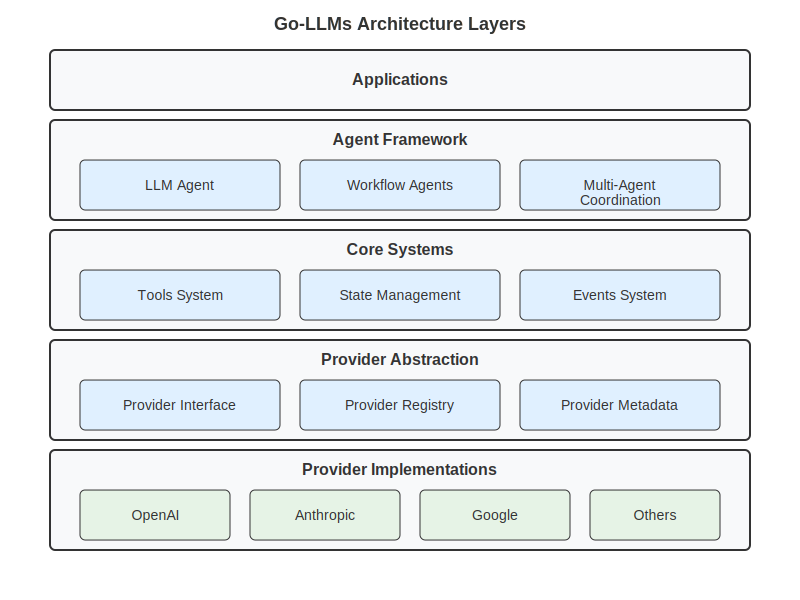

# Go-LLMs: Unified Go Library for LLM Integration

Build powerful AI applications with a clean, unified interface to multiple LLM providers. Go-LLMs provides everything you need: from simple text generation to complex multi-agent workflows with built-in tools and structured outputs.

## Why Go-LLMs?

- **One Library, All Providers** - Switch between OpenAI, Anthropic, Google, Ollama, and more with the same code
- **Production Readiness Mindset** - Built-in error handling, rate limiting, retries, and monitoring
- **Rich Tooling** - 33+ built-in tools for web, files, calculations, and data processing
- **Smart Agents** - Create conversational AI that can use tools and coordinate with other agents
- **Structured Data** - Get reliable, validated JSON/XML output instead of unpredictable text
- **Go Native** - Designed for Go developers with clean APIs and minimal dependencies

## Features

✨ **Unified Provider API** - OpenAI, Anthropic, Google Gemini, Vertex AI, Ollama, OpenRouter  
🛠️ **Built-in Tool System** - Web search, file operations, calculations, APIs, and more  
🤖 **Intelligent Agents** - Conversational AI with memory, tools, and workflow orchestration  
📊 **Structured Outputs** - JSON schema validation with automatic error recovery  
🔍 **Tool Discovery** - Dynamic tool exploration perfect for scripting engines  
🌐 **Multimodal Content** - Text, images, audio, video, and file support  
⚡ **Performance Optimized** - Concurrent execution, streaming, caching  

## Installation

```bash
go get github.com/lexlapax/go-llms
```

## Quick Start

Get started in 5 minutes with our [interactive quickstart guide](docs/user-guide/getting-started/quickstart.md).

### 1. Simple AI Conversation

```go
package main

import (
    "context"
    "fmt"
    "os"
    
    "github.com/lexlapax/go-llms/pkg/llm/provider"
    "github.com/lexlapax/go-llms/pkg/agent/core"
    "github.com/lexlapax/go-llms/pkg/llm/domain"
)

func main() {
    // Create provider
    p := provider.NewOpenAIProvider(os.Getenv("OPENAI_API_KEY"), "gpt-4")
    
    // Create agent
    agent := core.NewLLMAgent("assistant", "gpt-4", core.LLMDeps{Provider: p})
    agent.SetSystemPrompt("You are a helpful assistant.")
    
    // Chat
    state := domain.NewState()
    state.Set("user_input", "Explain quantum computing in simple terms")
    result, _ := agent.Run(context.Background(), state)
    
    fmt.Println(result.Get("response"))
}
```

### 2. Agent with Tools

```go
// Create smart agent with built-in tools
agent := core.NewLLMAgent("smart-assistant", "gpt-4", core.LLMDeps{Provider: p})

// Add powerful tools
agent.AddTool(web.NewWebSearchTool(webAPIKey))
agent.AddTool(file.NewFileReadTool())
agent.AddTool(calculator.NewCalculatorTool())

// Agent can now search web, read files, and calculate
state := domain.NewState()
state.Set("user_input", "Search for recent Go releases and calculate days since Go 1.21")
result, _ := agent.Run(context.Background(), state)
```

### 3. Structured Data Extraction

```go
// Define what you want
schema := &schema.Schema{
    Type: "object",
    Properties: map[string]*schema.Schema{
        "name":     {Type: "string"},
        "sentiment": {Type: "string", Enum: []interface{}{"positive", "negative", "neutral"}},
        "confidence": {Type: "number"},
    },
    Required: []string{"name", "sentiment"},
}

// Get reliable structured output
agent.SetSchema(schema)
state.Set("user_input", "Analyze this review: 'Amazing product, works perfectly!'")
result, _ := agent.Run(context.Background(), state)

// Guaranteed to match your schema
data := result.Get("structured_output")
```

### 4. Multi-Agent Workflows

```go
// Create specialized agents
extractor := core.NewLLMAgent("extractor", "gpt-4", core.LLMDeps{Provider: p})
analyzer := core.NewLLMAgent("analyzer", "claude-3-sonnet-20240229", core.LLMDeps{Provider: claude})

// Orchestrate with workflows
workflow := workflow.NewSequentialAgent("data-pipeline", []domain.BaseAgent{
    extractor,  // First: extract data from text
    analyzer,   // Second: analyze extracted data
})

// Process data through the pipeline
state.Set("document", "Large document content...")
result, _ := workflow.Run(context.Background(), state)
```

## Learning Resources

### 📖 Documentation
- **[Complete Documentation Hub](docs/README.md)** - Start here for everything
- **[5-Minute Quickstart](docs/user-guide/getting-started/quickstart.md)** - Get running immediately
- **[User Guide](docs/user-guide/README.md)** - Task-oriented guides with 5 learning paths
- **[Technical Documentation](docs/technical/README.md)** - Architecture and implementation details

### 🚀 Learning Paths
- **[Beginner Path](docs/user-guide/examples/beginner-projects.md)** - 5 simple projects to get started
- **[Developer Path](docs/user-guide/guides/building-chat-apps.md)** - Build production applications
- **[Architect Path](docs/user-guide/guides/multi-provider-strategies.md)** - Design robust systems
- **[Production Path](docs/user-guide/advanced/production-deployment.md)** - Deploy and scale

### 💡 Examples & Tutorials
- **[80+ Working Examples](cmd/examples/README.md)** - Provider, agent, tool, and workflow examples
- **[Chat Applications Guide](docs/user-guide/guides/building-chat-apps.md)** - Build conversational AI
- **[Data Extraction Guide](docs/user-guide/guides/building-data-extractors.md)** - Reliable data processing
- **[Agent Communication](docs/user-guide/guides/agent-communication.md)** - Multi-agent coordination

## Supported Providers

**OpenAI** • **Anthropic** • **Google Gemini** • **Google Vertex AI** • **Ollama** • **OpenRouter**

| Provider | Best For | Models | Setup |
|----------|----------|---------|-------|
| **OpenAI** | General use, reliability | GPT-4o, GPT-4 Turbo, GPT-4o-mini | [Guide](docs/user-guide/guides/provider-setup.md#openai) |
| **Anthropic** | Analysis, reasoning | Claude 3.5 Sonnet, Claude 3 Opus | [Guide](docs/user-guide/guides/provider-setup.md#anthropic) |
| **Google Gemini** | Multimodal, speed | Gemini 2.0 Flash Lite, Gemini Pro | [Guide](docs/user-guide/guides/provider-setup.md#google) ** |
| **Vertex AI** ** | Enterprise, compliance | Gemini + partner models | [Guide](docs/user-guide/guides/provider-setup.md#vertex-ai) |
| **Ollama** | Local hosting, privacy | Llama, Mistral, CodeLlama | [Guide](docs/user-guide/guides/local-providers.md) |
| **OpenRouter** | Model variety, cost | 400+ models (68 free) | [Guide](docs/user-guide/guides/provider-setup.md#openrouter) |

** Untested integration 

See our [provider comparison guide](docs/user-guide/reference/provider-comparison.md) for detailed feature matrices.

## What's New

### v0.3.5 (Latest) - Complete Scripting Engine Support 🚀
Comprehensive bridge integration for go-llmspell and other scripting engines:
- **Schema Repositories** with versioning and persistence  
- **Enhanced Error Handling** with serializable errors and recovery strategies
- **Event System** with serialization, filtering, and replay capabilities
- **Tool Discovery** with metadata-first exploration (33+ built-in tools)
- **Workflow Serialization** with templates and script-based execution
- **Testing Infrastructure** with mocks, fixtures, and comprehensive scenarios

Full release history in [CHANGELOG.md](CHANGELOG.md).

## Architecture

Go-LLMs uses a clean, modular architecture designed for reliability and extensibility:



```
pkg/
├── llm/         # Provider implementations and domain types
├── agent/       # Intelligent agents, tools, workflows, events
├── schema/      # JSON Schema validation and type conversion  
├── structured/  # Output parsing with error recovery
├── errors/      # Serializable error system with recovery
└── testutils/   # Comprehensive testing infrastructure
```

**Design Principles:**
- **Unified Interfaces** - Same API across all providers and components
- **Fail-Safe Defaults** - Graceful degradation and automatic error recovery  
- **Type Safety** - Strong typing with schema validation throughout
- **Performance First** - Concurrent execution, streaming, and efficient state management
- **Bridge Friendly** - JSON-serializable types for scripting engine integration

## Get Started

```bash
# Install
go get github.com/lexlapax/go-llms

# Try the quickstart
export OPENAI_API_KEY="your-key-here"
go run docs/user-guide/getting-started/quickstart.go
```

**Choose your path:**
- **New to AI?** → [5-Minute Quickstart](docs/user-guide/getting-started/quickstart.md)
- **Build apps?** → [Chat Application Guide](docs/user-guide/guides/building-chat-apps.md)  
- **Production use?** → [Enterprise Deployment](docs/user-guide/advanced/production-deployment.md)
- **Contributing?** → [Technical Documentation](docs/technical/README.md)

## Community & Support

- **[GitHub Issues](https://github.com/lexlapax/go-llms/issues)** - Bug reports and feature requests
- **[Discussions](https://github.com/lexlapax/go-llms/discussions)** - Questions and community
- **[Contributing Guide](CONTRIBUTING.md)** - Development and contribution guidelines
- **[Changelog](CHANGELOG.md)** - Complete version history

## Status

✅ **Actively Maintained** - Regular updates and improvements  
✅ **Comprehensive Testing** - 280+ tests with >85% coverage  
✅ **Complete Documentation** - User guides, API docs, examples  
✅ **Bridge Compatible** - Ready for scripting engine integration  

**License:** MIT - see [LICENSE](LICENSE) for details