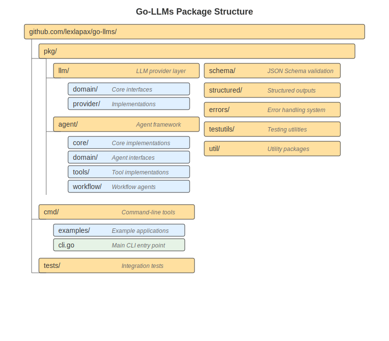

# Go-LLMs Technical Documentation

> **[Project Root](/) / [Documentation](/docs/) / Technical Documentation**

Welcome to the Go-LLMs technical documentation. This guide is designed for developers, contributors, and advanced users who want to understand the internals of the go-llms library.

## 📚 Documentation Structure

*Figure 1: Go-LLMs architectural layers showing the relationship between applications, agents, core systems, and providers*

*Figure 2: Package organization and dependencies within the go-llms codebase*

### 🏗️ Foundation
- [**Architecture Overview**](architecture.md) - System design, principles, and high-level structure
- [**Core Concepts**](core-concepts.md) - Key abstractions and design patterns

### 🔧 Core Components

#### [Providers](providers/README.md)
- [Provider System Overview](providers/overview.md) - Understanding LLM providers
- [Implementing Providers](providers/implementing-providers.md) - Create custom providers
- [Provider Registry](providers/provider-registry.md) - Dynamic registration and discovery
- [Provider Metadata](providers/metadata.md) - Capabilities and configuration

#### [Agents](agents/README.md)
- [Agent System Overview](agents/overview.md) - Agent architecture and concepts
- [LLM Agents](agents/llm-agents.md) - AI-powered agents with tool support
- [Workflow Agents](agents/workflow-agents.md) - Sequential, parallel, conditional, and loop patterns
- [Multi-Agent Systems](agents/multi-agent-systems.md) - Coordination and communication
- [State Management](agents/state-management.md) - Agent state and data flow

#### [Tools](tools/README.md)
- [Tool System Overview](tools/overview.md) - Tool architecture and integration
- [Creating Tools](tools/creating-tools.md) - Build custom tools
- [Tool Discovery](tools/tool-discovery.md) - Runtime registration and metadata
- [Built-in Tools](tools/built-in-tools.md) - Available tools and examples

### 🛠️ Development

#### [Contributing](development/contributing.md)
- Code organization and style guide
- Development workflow
- Submitting changes

#### [Testing](development/testing.md)
- Testing infrastructure
- Writing tests
- Mocks and fixtures
- Integration testing

#### [API Design](development/api-design.md)
- Design principles
- Interface patterns
- Backward compatibility

### 🚀 Advanced Topics

#### [Performance](advanced/performance.md)
- Optimization strategies
- Benchmarking
- Resource management

#### [Event System](advanced/event-system.md)
- Event architecture
- Custom event handlers
- Event serialization

#### [Error Handling](advanced/error-handling.md)
- Error types and patterns
- Recovery strategies
- Bridge-compatible errors

#### [Schema System](advanced/schema-system.md)
- JSON Schema validation
- Type conversion
- Structured outputs

#### [Bridge Integration](advanced/bridge-integration.md)
- Scripting engine integration
- Type conversion registry
- Workflow serialization

### 📖 Reference

#### [API Reference](api-reference/README.md)
- [Provider APIs](api-reference/providers.md)
- [Agent APIs](api-reference/agents.md)
- [Tool APIs](api-reference/tools.md)
- [Type Definitions](api-reference/types.md)

## 🎯 Quick Start Paths

### For New Contributors
1. Start with [Architecture Overview](architecture.md)
2. Read [Core Concepts](core-concepts.md)
3. Review [Contributing Guide](development/contributing.md)
4. Explore component documentation based on your interest

### For Provider Implementers
1. Read [Provider System Overview](providers/overview.md)
2. Follow [Implementing Providers](providers/implementing-providers.md)
3. Understand [Provider Metadata](providers/metadata.md)
4. Check [API Reference](api-reference/providers.md)

### For Tool Developers
1. Start with [Tool System Overview](tools/overview.md)
2. Follow [Creating Tools](tools/creating-tools.md)
3. Learn about [Tool Discovery](tools/tool-discovery.md)
4. See [Built-in Tools](tools/built-in-tools.md) for examples

### For Advanced Users
1. Understand [Agent System](agents/overview.md)
2. Explore [Workflow Patterns](agents/workflow-agents.md)
3. Learn about [Event System](advanced/event-system.md)
4. Deep dive into [Performance](advanced/performance.md)

## 📋 Document Standards

All documentation follows these standards:
- **Navigation**: Consistent breadcrumb navigation
- **Structure**: Overview → Concepts → Details → Examples
- **Code Examples**: Practical, runnable examples
- **Cross-References**: Links to related topics
- **Versioning**: Clear version annotations for features

## 🔄 Version Information

This documentation covers go-llms v0.3.5 and later. Features are annotated with their introduction version where relevant.

## 🤝 Contributing to Documentation

Found an issue or want to improve the documentation? See our [Contributing Guide](development/contributing.md#documentation).