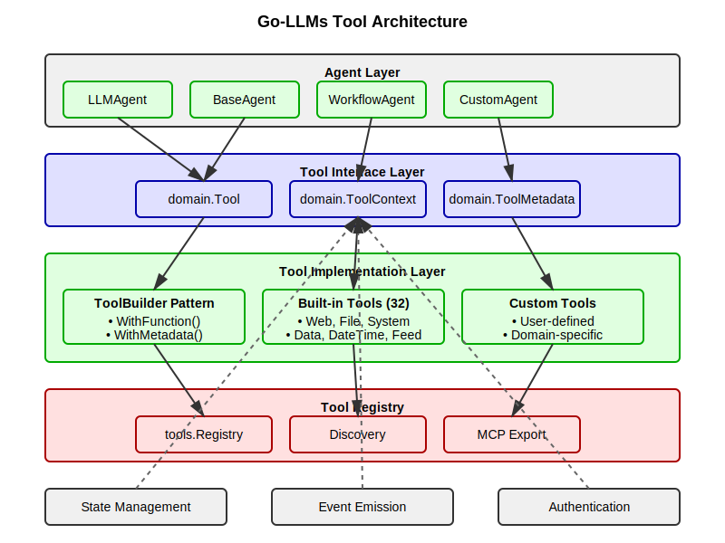
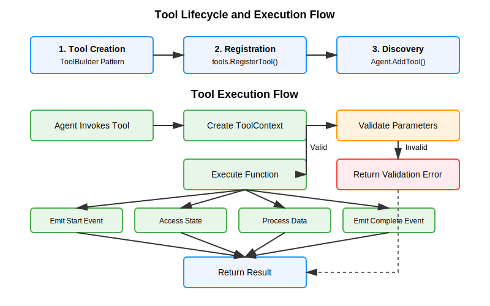
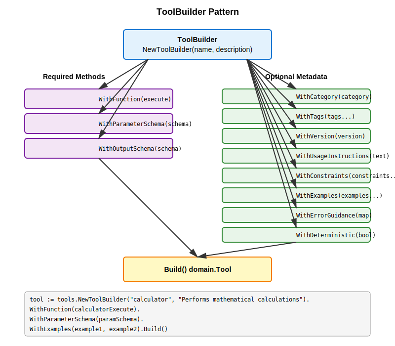

# Tools and Agent-Tool Integration

This document describes the comprehensive tool system in go-llms, including the enhanced Tool interface with ToolContext, the ToolBuilder pattern, bidirectional agent-tool integration, and the complete set of built-in tools.

## Table of Contents

- [Tool Interface and ToolContext](#tool-interface-and-toolcontext)
- [ToolBuilder Pattern](#toolbuilder-pattern)
- [Built-in Tools](#built-in-tools)
- [Agent-Tool Integration](#agent-tool-integration)
- [Tool Context System](#tool-context-system)
- [Best Practices](#best-practices)
- [Architecture](#architecture)

## Tool Interface and ToolContext

The enhanced Tool interface provides comprehensive metadata and guidance for LLMs, with execution through a rich ToolContext:

```go
type Tool interface {
    // Core functionality
    Name() string                                                      // Unique identifier
    Description() string                                               // Brief description
    Execute(ctx *ToolContext, params interface{}) (interface{}, error) // Execute with rich context

    // Schema definitions
    ParameterSchema() *domain.Schema // JSON Schema for input parameters
    OutputSchema() *domain.Schema    // JSON Schema for output structure

    // LLM guidance
    UsageInstructions() string        // Detailed instructions on when and how to use
    Examples() []ToolExample          // Concrete examples showing tool usage
    Constraints() []string            // Limitations and constraints
    ErrorGuidance() map[string]string // Map of error types to helpful guidance

    // Metadata
    Category() string // Category for grouping (e.g., "math", "web", "file")
    Tags() []string   // Tags for discovery and filtering
    Version() string  // Tool version for compatibility tracking

    // Behavioral hints
    IsDeterministic() bool      // Same input always produces same output
    IsDestructive() bool        // Tool modifies state or has side effects
    RequiresConfirmation() bool // User confirmation needed before execution
    EstimatedLatency() string   // Expected execution time: "fast", "medium", "slow"

    // MCP compatibility
    ToMCPDefinition() MCPToolDefinition // Export tool definition in MCP format
}
```

### ToolContext

The `ToolContext` provides tools with rich execution context including access to agent state, event emission, and execution metadata:

```go
type ToolContext struct {
    // Standard Go context for cancellation and deadlines
    Context context.Context
    
    // Read-only access to agent state
    State StateReader
    
    // Execution metadata
    RunID     string        // Unique execution identifier
    Retry     int           // Current retry attempt
    StartTime time.Time     // When execution started
    
    // Event emission capability
    Events EventEmitter     // Emit progress and custom events
    
    // Information about the calling agent
    Agent AgentInfo         // Agent metadata and hierarchy info
}
```

**Key ToolContext capabilities:**
- **State Access**: Read agent state for configuration and context
- **Event Emission**: Send progress, errors, and custom events
- **Agent Information**: Access agent metadata and hierarchy
- **Execution Tracking**: Retry counts, run IDs, and timing
- **Context Integration**: Full Go context.Context compatibility

## ToolBuilder Pattern

The ToolBuilder provides a fluent interface for creating tools with comprehensive metadata:

```go
tool := NewToolBuilder("calculator", "Performs arithmetic operations").
    WithFunction(calcFn).
    WithParameterSchema(schema).
    WithOutputSchema(outputSchema).
    WithUsageInstructions("Use when you need to perform mathematical calculations").
    WithExamples([]ToolExample{
        {
            Name:        "Addition",
            Description: "Adding two numbers",
            Input:       map[string]interface{}{"operation": "add", "a": 5, "b": 3},
            Output:      8,
            Explanation: "5 + 3 = 8",
        },
    }).
    WithConstraints([]string{
        "Division by zero returns an error",
        "Only supports basic arithmetic operations",
    }).
    WithErrorGuidance(map[string]string{
        "division_by_zero": "Cannot divide by zero. Check that 'b' is not 0.",
        "invalid_operation": "Operation must be one of: add, subtract, multiply, divide",
    }).
    WithCategory("math").
    WithTags([]string{"arithmetic", "calculation"}).
    WithBehavior(true, false, false, "fast"). // deterministic, not destructive, no confirmation, fast
    Build()
```

### Function Wrapping

The ToolBuilder can wrap various function signatures, with ToolContext being the recommended approach:

```go
// Function with struct parameter (basic)
type CalcParams struct {
    Operation string  `json:"operation"`
    A         float64 `json:"a"`
    B         float64 `json:"b"`
}
func calcFn(params CalcParams) (float64, error) { ... }

// Function with standard context
func contextFn(ctx context.Context, params CalcParams) (float64, error) { ... }

// Function with ToolContext (recommended)
func toolContextFn(ctx *domain.ToolContext, params CalcParams) (float64, error) {
    // Access agent state
    if apiKey, ok := ctx.State.Get("api_key"); ok {
        // Use configuration from state
    }
    
    // Emit progress events
    ctx.Events.EmitProgress(50, 100, "Processing calculation")
    
    // Access agent information
    if ctx.Agent.Type == domain.AgentTypeLLM {
        // Adapt behavior based on calling agent
    }
    
    return result, nil
}
```

## Built-in Tools

Go-llms provides a comprehensive set of built-in tools organized by category:

### File Tools (`pkg/agent/builtins/tools/file/`)
- `file_read` - Read files with metadata, line ranges, and streaming
- `file_write` - Write files with atomic operations and backups
- `file_list` - List directory contents with filtering
- `file_search` - Search files and content within files
- `file_move` - Move/rename files safely
- `file_delete` - Delete files with confirmation

### System Tools (`pkg/agent/builtins/tools/system/`)
- `execute_command` - Execute system commands safely
- `get_environment_variable` - Get environment variables with patterns
- `get_system_info` - Get system information
- `process_list` - List running processes

### Web Tools (`pkg/agent/builtins/tools/web/`)
- `web_search` - Search the web (supports multiple engines)
- `web_fetch` - Fetch and process web content
- `web_scrape` - Scrape web pages with selectors
- `http_request` - Make HTTP requests
- `api_client` - Advanced API client with REST, OpenAPI, and GraphQL support (see [Authentication](authentication.md) for auth details)

### Data Tools (`pkg/agent/builtins/tools/data/`)
- `json_process` - Parse and query JSON with JSONPath
- `csv_process` - Parse and transform CSV data
- `xml_process` - Parse and query XML with XPath
- `data_transform` - Filter, map, reduce, and transform data

### DateTime Tools (`pkg/agent/builtins/tools/datetime/`)
- `datetime_now` - Get current date/time
- `datetime_info` - Extract date/time components
- `datetime_calculate` - Add/subtract time, business days
- `datetime_parse` - Parse date/time strings
- `datetime_format` - Format date/time
- `datetime_convert` - Convert between timezones
- `datetime_compare` - Compare dates and times

### Feed Tools (`pkg/agent/builtins/tools/feed/`)
- `feed_fetch` - Fetch RSS/Atom feeds
- `feed_discover` - Discover feed URLs
- `feed_filter` - Filter feed entries
- `feed_aggregate` - Aggregate multiple feeds
- `feed_convert` - Convert between feed formats
- `feed_extract` - Extract content from feeds

### Math Tools (`pkg/agent/builtins/tools/math/`)
- `calculator` - Comprehensive calculator with advanced operations

## Tool Context System

The ToolContext system provides tools with comprehensive access to agent state, event emission, and execution metadata. This enables sophisticated tool behaviors that can adapt to context and provide rich feedback.

### StateReader Interface

Tools receive read-only access to agent state through the StateReader interface:

```go
type StateReader interface {
    Get(key string) (interface{}, bool)    // Get a value by key
    Values() map[string]interface{}        // Get all values
    GetArtifact(id string) (*Artifact, bool) // Get artifact by ID
    Artifacts() map[string]*Artifact       // Get all artifacts
    Messages() []Message                   // Get conversation messages
    GetMetadata(key string) (interface{}, bool) // Get metadata
    Has(key string) bool                   // Check if key exists
    Keys() []string                        // Get all keys
}
```

**Common state access patterns:**

```go
func myTool(ctx *domain.ToolContext, params MyParams) (*MyResult, error) {
    // Configuration from state
    if timeout, ok := ctx.State.Get("timeout"); ok {
        if timeoutInt, ok := timeout.(int); ok {
            // Use timeout value
        }
    }
    
    // Authentication credentials
    if apiKey, ok := ctx.State.Get("api_key"); ok {
        // Use API key for authentication
    }
    
    // Previous results for context
    if lastResult, ok := ctx.State.Get("last_result"); ok {
        // Build on previous results
    }
    
    // Access conversation messages
    messages := ctx.State.Messages()
    for _, msg := range messages {
        // Analyze conversation context
    }
    
    return result, nil
}
```

### EventEmitter Interface

Tools can emit events for monitoring, progress tracking, and debugging:

```go
type EventEmitter interface {
    Emit(eventType EventType, data interface{})     // Send typed event
    EmitProgress(current, total int, message string) // Send progress update
    EmitMessage(message string)                      // Send informational message
    EmitError(err error)                            // Send error event
    EmitCustom(eventName string, data interface{})  // Send custom event
}
```

**Event emission patterns:**

```go
func longRunningTool(ctx *domain.ToolContext, params MyParams) (*MyResult, error) {
    // Emit start event
    ctx.Events.Emit(domain.EventTypeToolStart, map[string]interface{}{
        "tool": "long_running_tool",
        "params": params,
    })
    
    totalSteps := 100
    for i := 0; i < totalSteps; i++ {
        // Process step
        processStep(i)
        
        // Emit progress
        ctx.Events.EmitProgress(i+1, totalSteps, fmt.Sprintf("Processing step %d", i+1))
        
        // Check for cancellation
        if ctx.Context.Err() != nil {
            ctx.Events.EmitError(ctx.Context.Err())
            return nil, ctx.Context.Err()
        }
    }
    
    // Emit completion
    ctx.Events.Emit(domain.EventTypeToolComplete, result)
    return result, nil
}
```

### AgentInfo Access

Tools can access information about the calling agent for context-aware behavior:

```go
type AgentInfo struct {
    ID          string                     // Agent unique identifier
    Name        string                     // Agent name
    Description string                     // Agent description
    Type        AgentType                  // Agent type (LLM, Workflow, Custom)
    ParentID    string                     // Parent agent ID (if sub-agent)
    ParentName  string                     // Parent agent name
    Depth       int                        // Depth in agent hierarchy
    Metadata    map[string]interface{}     // Additional agent metadata
}
```

**Agent-aware tool behavior:**

```go
func adaptiveTool(ctx *domain.ToolContext, params MyParams) (*MyResult, error) {
    // Adapt based on agent type
    switch ctx.Agent.Type {
    case domain.AgentTypeLLM:
        // Provide more detailed output for LLM agents
        result.Explanation = "Detailed explanation for LLM processing"
    case domain.AgentTypeWorkflow:
        // Provide structured output for workflow agents
        result.StructuredData = generateStructuredOutput(params)
    }
    
    // Check agent hierarchy
    if ctx.Agent.Depth > 0 {
        // This is a sub-agent call, adjust behavior
        result.Context = fmt.Sprintf("Called by sub-agent %s", ctx.Agent.Name)
    }
    
    // Access agent metadata
    if priority, ok := ctx.Agent.Metadata["priority"]; ok {
        if priorityStr, ok := priority.(string); ok && priorityStr == "high" {
            // Use expedited processing for high-priority agents
        }
    }
    
    return result, nil
}
```

### Execution Metadata

Tools have access to execution context including retry information and timing:

```go
func robustTool(ctx *domain.ToolContext, params MyParams) (*MyResult, error) {
    // Check retry count
    if ctx.Retry > 0 {
        ctx.Events.EmitMessage(fmt.Sprintf("Retry attempt %d", ctx.Retry))
        
        // Adjust behavior for retries
        if ctx.Retry > 2 {
            // Use more conservative approach after multiple retries
            params.Timeout *= 2
        }
    }
    
    // Check execution time
    if ctx.ElapsedTime() > time.Minute {
        ctx.Events.EmitMessage("Long-running execution detected")
    }
    
    // Use unique run ID for correlation
    ctx.Events.EmitCustom("processing_started", map[string]interface{}{
        "run_id": ctx.RunID,
        "retry": ctx.Retry,
        "start_time": ctx.StartTime,
    })
    
    return result, nil
}
```

### Context Integration

ToolContext implements the standard Go context.Context interface:

```go
func contextAwareTool(ctx *domain.ToolContext, params MyParams) (*MyResult, error) {
    // Use as standard Go context
    select {
    case <-ctx.Done():
        return nil, ctx.Err() // Handle cancellation
    case result := <-processWithTimeout(ctx.Context, params):
        return result, nil
    }
}

func processWithTimeout(ctx context.Context, params MyParams) <-chan *MyResult {
    resultChan := make(chan *MyResult, 1)
    go func() {
        // Long-running process with context cancellation
        select {
        case <-ctx.Done():
            return
        case <-time.After(time.Second):
            resultChan <- &MyResult{Success: true}
        }
    }()
    return resultChan
}
```

## Agent-Tool Integration

The agent-tool integration provides bidirectional conversion between Agents and Tools:

### AgentTool: Wrap Agent as Tool

AgentTool wraps a `BaseAgent` to expose it as a `Tool`:

```go
// Create an agent
agent := myTextProcessingAgent()

// Wrap as tool with custom mappings
tool := tools.NewAgentTool(agent).
    // Map tool parameters to state keys
    WithStateMapper(tools.CreateStateMapper(map[string]string{
        "text": "input",     // tool param "text" -> state key "input"
        "mode": "settings",  // tool param "mode" -> state key "settings"
    })).
    // Extract specific fields from result state
    WithResultMapper(tools.CreateResultMapper("output", "status"))

// Use as tool
result, err := tool.Execute(ctx, map[string]interface{}{
    "text": "hello world",
    "mode": "upper",
})
```

### ToolAgent: Wrap Tool as Agent

ToolAgent wraps a `Tool` to expose it as a `BaseAgent`:

```go
// Create a tool
tool := myCalculatorTool()

// Wrap as agent with custom mappings
agent := tools.NewToolAgent(tool).
    // Extract tool parameters from state
    WithParamMapper(tools.CreateParamMapper(map[string]string{
        "num1": "a",        // state key "num1" -> param "a"
        "num2": "b",        // state key "num2" -> param "b"
        "operation": "op",  // state key "operation" -> param "op"
    })).
    // Update state with prefixed results
    WithStateUpdater(tools.CreateStateUpdaterWithPrefix("calc"))

// Use as agent
state := domain.NewState()
state.Set("num1", 10)
state.Set("num2", 5)
state.Set("operation", "add")
result, err := agent.Run(ctx, state)
```

### Mapper Functions

#### State Mappers (for AgentTool)

```go
// Default mapper - handles maps, strings, and State objects
DefaultStateMapper

// Custom field mapping
CreateStateMapper(map[string]string{
    "param_name": "state_key",
})

// Custom function
customMapper := func(ctx context.Context, params interface{}) (*domain.State, error) {
    // Custom mapping logic
    return state, nil
}
```

#### Result Mappers (for AgentTool)

```go
// Default mapper - looks for "result", "output", or "response" keys
DefaultResultMapper

// Extract specific fields
CreateResultMapper("field1", "field2")

// Custom function
customMapper := func(ctx context.Context, state *domain.State) (interface{}, error) {
    // Custom extraction logic
    return result, nil
}
```

#### Parameter Mappers (for ToolAgent)

```go
// Default mapper - looks for "params" or "input" keys
DefaultParamMapper

// Map state keys to parameter names
CreateParamMapper(map[string]string{
    "state_key": "param_name",
})

// Extract single parameter
CreateSingleParamMapper("input_text")
```

#### State Updaters (for ToolAgent)

```go
// Default updater - sets "result" and "success" keys
DefaultStateUpdater

// Add prefix to all result keys
CreateStateUpdaterWithPrefix("tool_name")

// Custom function
customUpdater := func(ctx context.Context, state *domain.State, result interface{}, err error) (*domain.State, error) {
    // Custom update logic
    return state, nil
}
```

### Integration with LLMAgent

The agent-tool wrappers integrate seamlessly with LLMAgent:

```go
// Create LLM agent
llmAgent := core.NewLLMAgent("assistant", "AI assistant", provider)

// Add regular tools
llmAgent.AddTool(calculatorTool)

// Add agents as tools
textAgent := createTextProcessingAgent()
llmAgent.AddTool(tools.NewAgentTool(textAgent))

// The LLM can now call both tools and agents
```

### Use Cases

#### 1. Expose Complex Agents as Simple Tools

```go
// Complex multi-step agent
researchAgent := workflow.NewSequentialAgent("researcher").
    AddSubAgent(searchAgent).
    AddSubAgent(analyzeAgent).
    AddSubAgent(summarizeAgent)

// Expose as simple tool
researchTool := tools.NewAgentTool(researchAgent).
    WithStateMapper(func(ctx context.Context, params interface{}) (*domain.State, error) {
        query := params.(string)
        state := domain.NewState()
        state.Set("query", query)
        return state, nil
    }).
    WithResultMapper(tools.CreateResultMapper("summary"))

// Now usable in LLM function calling
llmAgent.AddTool(researchTool)
```

#### 2. Use Tools in Agent Workflows

```go
// Existing tools
calcTool := createCalculatorTool()
weatherTool := createWeatherTool()

// Wrap as agents
calcAgent := tools.NewToolAgent(calcTool)
weatherAgent := tools.NewToolAgent(weatherTool)

// Use in workflow
workflow := workflow.NewSequentialAgent("data-processor").
    AddSubAgent(weatherAgent).  // Get weather data
    AddSubAgent(calcAgent)      // Process temperature calculations
```

#### 3. Bidirectional Conversion

```go
// Start with agent
agent := myAgent()

// Convert to tool for LLM use
tool := tools.NewAgentTool(agent)

// Convert back to agent for workflow use
agentAgain := tools.NewToolAgent(tool)
```

## Best Practices

### Tool Design

1. **Use Struct Parameters**: Always use structs for function parameters instead of multiple arguments
   ```go
   // Good
   type Params struct {
       X int `json:"x"`
       Y int `json:"y"`
   }
   func add(params Params) int { return params.X + params.Y }
   
   // Avoid
   func add(x, y int) int { return x + y }
   ```

2. **Provide Comprehensive Metadata**: Use ToolBuilder to add all relevant metadata
   - Clear usage instructions
   - Multiple examples covering different scenarios
   - Constraints and limitations
   - Error guidance for common failures

3. **Schema Validation**: Always define parameter schemas for input validation
   ```go
   schema := &sdomain.Schema{
       Type: "object",
       Properties: map[string]sdomain.Property{
           "text": {
               Type:        "string",
               Description: "Input text to process",
               MinLength:   1,
               MaxLength:   1000,
           },
       },
       Required: []string{"text"},
   }
   ```

4. **Error Handling**: Return meaningful errors with context
   ```go
   if params.B == 0 {
       return 0, fmt.Errorf("division by zero: divisor 'b' cannot be 0")
   }
   ```

5. **Behavioral Hints**: Accurately describe tool behavior
   - Mark destructive operations (file deletion, system changes)
   - Require confirmation for dangerous operations
   - Indicate if results are deterministic
   - Provide realistic latency estimates

### Agent-Tool Integration

1. **Clear Naming**: Use descriptive names for state keys and parameters
2. **State Isolation**: Be mindful of state modifications in workflows
3. **Testing**: Test both directions of conversion
4. **Documentation**: Document parameter mappings clearly

## Architecture

### Tool System Overview



The tool system in go-llms follows a layered architecture:

1. **Agent Layer**: Various agent types (LLMAgent, BaseAgent, WorkflowAgent) that can use tools
2. **Tool Interface Layer**: Core interfaces (domain.Tool, domain.ToolContext, domain.ToolMetadata)
3. **Tool Implementation Layer**: Actual tool implementations using ToolBuilder pattern
4. **Tool Registry**: Global registry for tool discovery and management

Cross-cutting concerns like state management, event emission, and authentication flow through the ToolContext.

### Tool Lifecycle



The tool lifecycle consists of two main phases:

**Creation and Registration Phase:**
1. **Tool Creation**: Use ToolBuilder pattern to create tools with metadata
2. **Registration**: Register tools in the global registry
3. **Discovery**: Agents discover and add tools via registry or direct assignment

**Execution Phase:**
1. **Agent Invokes Tool**: Agent decides to use a tool based on context
2. **Create ToolContext**: Framework creates context with state, events, and metadata
3. **Validate Parameters**: Tool validates input against parameter schema
4. **Execute Function**: If valid, execute the tool's core functionality
   - Emit start event
   - Access state for configuration
   - Process data
   - Emit completion event
5. **Return Result**: Return structured result or error

### ToolBuilder Pattern Details



The ToolBuilder pattern provides a fluent interface for creating tools:

**Required Components:**
- `WithFunction()`: The execution function
- `WithParameterSchema()`: Input validation schema
- `WithOutputSchema()`: Output structure schema

**Optional Metadata:**
- `WithCategory()`: Tool categorization
- `WithTags()`: Discovery tags
- `WithVersion()`: Version tracking
- `WithUsageInstructions()`: LLM guidance
- `WithConstraints()`: Limitations
- `WithExamples()`: Usage examples
- `WithErrorGuidance()`: Error handling guidance
- `WithDeterministic()`: Behavioral hints

All methods return the builder for chaining, and `Build()` creates the final tool.

## Enhanced Features

### Comprehensive ToolContext Integration

All tools in go-llms use the ToolContext system for rich execution context:

**State-Based Configuration:**
```go
func configuredTool(ctx *domain.ToolContext, params MyParams) (*MyResult, error) {
    // Access user preferences
    if theme, ok := ctx.State.Get("ui_theme"); ok {
        result.Theme = theme.(string)
    }
    
    // Get API endpoints from state
    if endpoint, ok := ctx.State.Get("api_endpoint"); ok {
        params.Endpoint = endpoint.(string)
    }
    
    return result, nil
}
```

**Event-Driven Monitoring:**
```go
func monitoredTool(ctx *domain.ToolContext, params MyParams) (*MyResult, error) {
    // Start event with tool metadata
    ctx.Events.Emit(domain.EventTypeToolStart, map[string]interface{}{
        "tool": "monitored_tool",
        "agent": ctx.Agent.Name,
        "run_id": ctx.RunID,
    })
    
    // Progress tracking
    steps := []string{"validate", "process", "format", "return"}
    for i, step := range steps {
        ctx.Events.EmitProgress(i+1, len(steps), fmt.Sprintf("Executing: %s", step))
        executeStep(step, params)
    }
    
    // Custom events for specific metrics
    ctx.Events.EmitCustom("performance_metric", map[string]interface{}{
        "execution_time_ms": ctx.ElapsedTime().Milliseconds(),
        "memory_used_mb": getMemoryUsage(),
    })
    
    return result, nil
}
```

### Advanced Authentication Support

Web tools support comprehensive authentication through state-based credential management:

```go
func authenticatedWebTool(ctx *domain.ToolContext, params WebParams) (*WebResult, error) {
    // Multiple authentication methods detected automatically
    authConfig := auth.DetectAuthFromState(ctx.State, params.URL)
    
    if authConfig != nil {
        params.Headers = authConfig.Apply(params.Headers)
        ctx.Events.EmitCustom("auth_applied", map[string]interface{}{
            "method": authConfig.Type,
            "url_pattern": authConfig.URLPattern,
        })
    }
    
    return executeRequest(params)
}
```

**Supported authentication methods:**
1. **Bearer Token**: `ctx.State.Get("bearer_token")` or provider-specific tokens
2. **API Key**: Header, query parameter, or cookie-based
3. **Basic Auth**: Username/password combinations
4. **OAuth2**: Access tokens with automatic refresh detection
5. **Custom Headers**: Flexible header-based authentication
6. **URL Pattern Matching**: Automatic credential selection based on URL patterns

### Tool Registry and Discovery

Global registry with comprehensive tool management:

```go
// Registration (automatic for built-in tools)
tools.RegisterTool(myCustomTool)

// Discovery by various criteria
tool, exists := tools.GetTool("calculator")
mathTools := tools.Tools.ListByCategory("math")
webTools := tools.Tools.SearchByTags("web", "api")
recentTools := tools.Tools.ListByVersion(">=2.0.0")

// Export capabilities
allMCPDefs := tools.Tools.ExportAllToMCP()
toolCatalog := tools.Tools.GenerateCatalog()
```

### MCP (Model Context Protocol) Compatibility

Full MCP export with rich metadata:

```go
// Individual tool export
mcpDef := tool.ToMCPDefinition()
// Includes: name, description, input/output schemas, behavioral hints

// Batch export with filtering
webToolsMCP := tools.Tools.ExportCategoryToMCP("web")
allToolsMCP := tools.Tools.ExportAllToMCP()

// MCP definition includes:
type MCPToolDefinition struct {
    Name         string                 `json:"name"`
    Description  string                 `json:"description"`
    InputSchema  interface{}            `json:"inputSchema,omitempty"`
    OutputSchema interface{}            `json:"outputSchema,omitempty"`
    Annotations  map[string]interface{} `json:"annotations,omitempty"`
}
```

### Performance and Reliability Features

**Retry-Aware Execution:**
```go
func resilientTool(ctx *domain.ToolContext, params MyParams) (*MyResult, error) {
    if ctx.Retry > 0 {
        // Exponential backoff for retries
        backoffMs := int64(math.Pow(2, float64(ctx.Retry)) * 1000)
        time.Sleep(time.Duration(backoffMs) * time.Millisecond)
        
        // More conservative parameters on retry
        params.Timeout = params.Timeout * 2
        params.Retries = params.Retries - 1
    }
    
    return executeWithRetryLogic(ctx, params)
}
```

**Cancellation Support:**
```go
func cancellableTool(ctx *domain.ToolContext, params MyParams) (*MyResult, error) {
    resultChan := make(chan *MyResult)
    errorChan := make(chan error)
    
    go func() {
        result, err := longRunningOperation(params)
        if err != nil {
            errorChan <- err
        } else {
            resultChan <- result
        }
    }()
    
    select {
    case <-ctx.Done():
        ctx.Events.EmitMessage("Tool execution cancelled")
        return nil, ctx.Err()
    case result := <-resultChan:
        return result, nil
    case err := <-errorChan:
        ctx.Events.EmitError(err)
        return nil, err
    }
}
```

### Schema Validation and Type Safety

Built-in parameter validation and type coercion:

```go
// Parameter schema with validation
paramSchema := &domain.Schema{
    Type: "object",
    Properties: map[string]*domain.Schema{
        "temperature": {
            Type:    "number",
            Minimum: -273.15,  // Absolute zero
            Maximum: 1000.0,   // Reasonable upper limit
        },
        "unit": {
            Type: "string",
            Enum: []interface{}{"celsius", "fahrenheit", "kelvin"},
        },
    },
    Required: []string{"temperature"},
}

// Automatic validation happens before Execute() is called
// Tools receive validated and coerced parameters
```

## Complete Example

Here's a comprehensive example showing how to create a custom tool using the ToolBuilder pattern:

```go
package customtools

import (
    "fmt"
    "time"
    
    "github.com/lexlapax/go-llms/pkg/agent/domain"
    "github.com/lexlapax/go-llms/pkg/agent/tools"
    sdomain "github.com/lexlapax/go-llms/pkg/schema/domain"
)

// Define parameter and result structs
type WeatherParams struct {
    City        string `json:"city" description:"City name"`
    Country     string `json:"country,omitempty" description:"Country code (ISO 3166)"`
    Units       string `json:"units,omitempty" description:"Temperature units (celsius/fahrenheit)"`
}

type WeatherResult struct {
    City        string  `json:"city"`
    Country     string  `json:"country"`
    Temperature float64 `json:"temperature"`
    Description string  `json:"description"`
    Humidity    int     `json:"humidity"`
    WindSpeed   float64 `json:"wind_speed"`
    Units       string  `json:"units"`
    Timestamp   string  `json:"timestamp"`
}

// Create the execution function
func weatherExecute(ctx *domain.ToolContext, params WeatherParams) (*WeatherResult, error) {
    // Emit start event
    ctx.EmitEvent(domain.EventTypeToolStart, map[string]interface{}{
        "tool": "weather",
        "city": params.City,
    })
    
    // Validate parameters
    if params.City == "" {
        return nil, fmt.Errorf("city is required")
    }
    
    // Default units to celsius
    if params.Units == "" {
        params.Units = "celsius"
    }
    
    // Check for API key in state
    apiKey, ok := ctx.State.Get("weather_api_key")
    if !ok {
        return nil, fmt.Errorf("weather API key not found in state")
    }
    
    // Progress event
    ctx.EmitProgress(50, 100, "Fetching weather data")
    
    // Mock weather data (in real implementation, call weather API)
    result := &WeatherResult{
        City:        params.City,
        Country:     params.Country,
        Temperature: 22.5,
        Description: "Partly cloudy",
        Humidity:    65,
        WindSpeed:   12.5,
        Units:       params.Units,
        Timestamp:   time.Now().Format(time.RFC3339),
    }
    
    // Convert temperature if needed
    if params.Units == "fahrenheit" {
        result.Temperature = result.Temperature*9/5 + 32
    }
    
    // Emit completion event
    ctx.EmitEvent(domain.EventTypeToolComplete, result)
    
    return result, nil
}

// Create the tool using ToolBuilder
func CreateWeatherTool() domain.Tool {
    paramSchema := &sdomain.Schema{
        Type: "object",
        Properties: map[string]*sdomain.Schema{
            "city": {
                Type:        "string",
                Description: "City name",
                MinLength:   1,
                MaxLength:   100,
            },
            "country": {
                Type:        "string",
                Description: "Country code (ISO 3166)",
                Pattern:     "^[A-Z]{2}$",
            },
            "units": {
                Type:        "string",
                Description: "Temperature units",
                Enum:        []interface{}{"celsius", "fahrenheit"},
                Default:     "celsius",
            },
        },
        Required: []string{"city"},
    }
    
    outputSchema := &sdomain.Schema{
        Type: "object",
        Properties: map[string]*sdomain.Schema{
            "city":        {Type: "string"},
            "country":     {Type: "string"},
            "temperature": {Type: "number"},
            "description": {Type: "string"},
            "humidity":    {Type: "integer", Minimum: 0, Maximum: 100},
            "wind_speed":  {Type: "number", Minimum: 0},
            "units":       {Type: "string"},
            "timestamp":   {Type: "string", Format: "date-time"},
        },
        Required: []string{"city", "temperature", "description", "units", "timestamp"},
    }
    
    return tools.NewToolBuilder("weather", "Get current weather information for a city").
        WithCategory("web").
        WithTags("weather", "api", "temperature", "forecast").
        WithVersion("1.0.0").
        WithFunction(weatherExecute).
        WithParameterSchema(paramSchema).
        WithOutputSchema(outputSchema).
        WithUsageInstructions(`Use this tool to get current weather information for any city.
        
The tool returns:
- Current temperature (in specified units)
- Weather description
- Humidity percentage
- Wind speed
- Timestamp of the observation

Make sure to specify the country code for ambiguous city names.`).
        WithConstraints(
            "Requires weather_api_key in agent state",
            "City names must be in English",
            "Country codes must be ISO 3166 2-letter codes",
            "Temperature units limited to celsius or fahrenheit",
            "Real-time data depends on API availability",
        ).
        WithExamples(
            tools.Example{
                Name:        "Basic weather query",
                Description: "Get weather for a major city",
                Input:       map[string]interface{}{"city": "London"},
                Output: map[string]interface{}{
                    "city":        "London",
                    "temperature": 15.5,
                    "description": "Cloudy",
                    "humidity":    78,
                    "wind_speed":  8.5,
                    "units":       "celsius",
                    "timestamp":   "2024-01-10T14:30:00Z",
                },
            },
            tools.Example{
                Name:        "Weather with country and units",
                Description: "Specify country for ambiguous cities and use Fahrenheit",
                Input: map[string]interface{}{
                    "city":    "Paris",
                    "country": "FR",
                    "units":   "fahrenheit",
                },
                Output: map[string]interface{}{
                    "city":        "Paris",
                    "country":     "FR",
                    "temperature": 68.0,
                    "description": "Sunny",
                    "humidity":    45,
                    "wind_speed":  5.0,
                    "units":       "fahrenheit",
                    "timestamp":   "2024-01-10T14:30:00Z",
                },
            },
        ).
        WithErrorGuidance(map[string]string{
            "city is required":      "Provide a city name in the 'city' parameter",
            "api key not found":     "Set weather_api_key in agent state before using this tool",
            "invalid country code":  "Use 2-letter ISO country codes (e.g., US, GB, FR)",
            "unknown city":          "City not found. Check spelling or add country code",
            "api rate limit":        "Too many requests. Wait before trying again",
        }).
        WithDeterministic(false).        // Weather changes
        WithDestructive(false).          // Read-only operation
        WithRequiresConfirmation(false). // Safe to call
        WithEstimatedLatency("medium").  // API call required
        Build()
}

// Register the tool
func init() {
    tools.RegisterTool(CreateWeatherTool())
}
```

## Working Examples

For complete working examples, see:
- `cmd/examples/agent-calculator/` - Calculator tool with LLM integration
- `cmd/examples/builtins-*` - Examples of all built-in tool categories
- `cmd/examples/agent-tools-conversion/` - Agent-tool conversion examples
- `pkg/agent/tools/example_test.go` - API usage examples