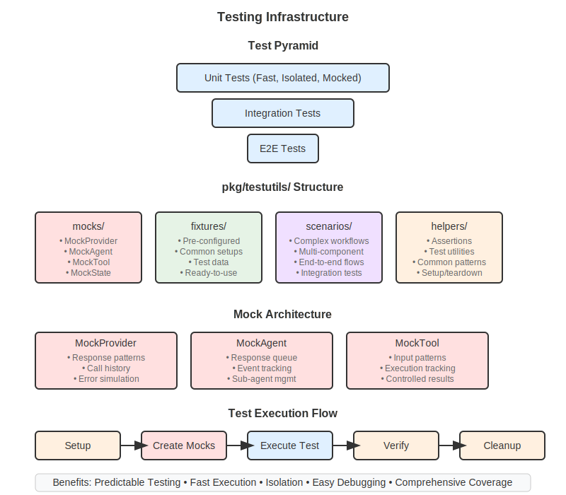

# Testing Strategies

> **[User Guide](../README.md) / Advanced / Testing Strategies**

Learn how to effectively test LLM applications using go-llms' comprehensive testing infrastructure. This guide covers everything from basic unit tests to complex scenario testing.

## Why Test LLM Applications?

Testing AI applications presents unique challenges:
- **Non-deterministic outputs** - Same input can produce different responses
- **External dependencies** - API calls to LLM providers
- **Complex workflows** - Multi-agent coordination and tool interactions
- **Performance considerations** - Response times and rate limits

go-llms provides powerful testing utilities to handle these challenges.

## Testing Infrastructure Overview


*Complete testing infrastructure with mocks, fixtures, scenarios, and utilities*

The testing infrastructure includes:
- **Mocks** - Controllable provider, agent, and tool implementations
- **Fixtures** - Pre-configured test objects
- **Scenarios** - Complex test workflows
- **Helpers** - Testing utilities and assertions

## Quick Start: Basic Testing

### 1. Provider Testing

Test LLM provider functionality with controllable responses:

```go
package main

import (
    "context"
    "testing"
    
    "github.com/lexlapax/go-llms/pkg/testutils/fixtures"
    "github.com/lexlapax/go-llms/pkg/testutils/mocks"
    "github.com/stretchr/testify/assert"
)

func TestBasicProvider(t *testing.T) {
    // Use a pre-configured ChatGPT-like provider
    provider := fixtures.ChatGPTMockProvider()

    // Test basic generation
    response, err := provider.Generate(context.Background(), "Hello!")
    assert.NoError(t, err)
    assert.Contains(t, response, "Hello")

    // Test pattern-based responses
    provider.WithPatternResponse("(?i).*weather.*", mocks.Response{
        Content: "Today is sunny with 75°F",
        Metadata: map[string]interface{}{
            "location":   "test-city",
            "confidence": 0.95,
        },
}

    response, err = provider.Generate(context.Background(), "What's the weather like?")
    assert.NoError(t, err)
    assert.Contains(t, response, "sunny")

    // Verify call history
    history := provider.GetCallHistory()
    assert.Len(t, history, 2)
    assert.Equal(t, "Hello!", history[0].Input)
    assert.Contains(t, history[1].Input, "weather")
}
```

### 2. Agent Testing

Test agent behavior with controllable inputs and outputs:

```go
func TestAgent(t *testing.T) {
    // Test simple agent
    agent := fixtures.SimpleMockAgent()
    input := fixtures.BasicTestState()
    input.Set("message", "Process this data")

    result, err := agent.Run(context.Background(), input)
    assert.NoError(t, err)
    
    message, exists := result.Get("message")
    assert.True(t, exists)
    assert.Equal(t, "Simple agent response", message)

    // Test research agent with specific query
    researchAgent := fixtures.ResearchMockAgent()
    researchInput := fixtures.BasicTestState()
    researchInput.Set("query", "quantum computing trends")
    researchInput.Set("depth", "comprehensive")

    result, err = researchAgent.Run(context.Background(), researchInput)
    assert.NoError(t, err)

    taskType, _ := result.Get("task_type")
    assert.Equal(t, "research", taskType)

    query, _ := result.Get("processed_query")
    assert.Contains(t, query.(string), "quantum")
}
```

### 3. Tool Testing

Test tools with proper context and state management:

```go
func TestTools(t *testing.T) {
    // Create a calculator tool fixture
    calc := fixtures.CalculatorMockTool()
    
    // Create test context using helpers
    ctx := helpers.CreateTestToolContext()

    // Test addition
    result, err := calc.Execute(ctx, map[string]interface{}{
        "operation": "add",
        "a":         5.0,
        "b":         3.0,
}
    assert.NoError(t, err)
    assert.Equal(t, 8.0, result["result"])

    // Test multiplication with custom state
    stateData := map[string]interface{}{
        "precision": 2,
        "mode":      "scientific",
    }
    ctx = helpers.CreateToolContextWithState(stateData)

    result, err = calc.Execute(ctx, map[string]interface{}{
        "operation": "multiply",
        "a":         2.5,
        "b":         4.0,
}
    assert.NoError(t, err)
    assert.Equal(t, 10.0, result["result"])
}
```

## Advanced Testing Patterns

### Error Simulation Testing

Test how your application handles various error conditions:

```go
func TestErrorHandling(t *testing.T) {
    // Test provider errors
    errorProvider := fixtures.ErrorMockProvider("rate_limit")
    
    _, err := errorProvider.Generate(context.Background(), "test prompt")
    assert.Error(t, err)
    assert.Contains(t, err.Error(), "rate_limit")

    // Test slow provider with timeout
    slowProvider := fixtures.SlowMockProvider(2 * time.Second)
    
    ctx, cancel := context.WithTimeout(context.Background(), 500*time.Millisecond)
    defer cancel()

    _, err = slowProvider.Generate(ctx, "test prompt")
    assert.Error(t, err)
    assert.Contains(t, err.Error(), "context deadline exceeded")

    // Test error tool
    errorTool := fixtures.ErrorMockTool(0.5) // 50% error rate
    toolCtx := helpers.CreateTestToolContext()

    // Run multiple times to test error rate
    var errorCount int
    for i := 0; i < 10; i++ {
        _, err := errorTool.Execute(toolCtx, map[string]interface{}{"test": "data"})
        if err != nil {
            errorCount++
        }
    }
    
    // Should have some errors but not all (due to randomness, this is approximate)
    assert.Greater(t, errorCount, 0)
    assert.Less(t, errorCount, 10)
}
```

### State Management Testing

Test different state configurations and data flows:

```go
func TestStateManagement(t *testing.T) {
    // Test with basic state
    basicState := fixtures.BasicTestState()
    
    value, exists := basicState.Get("test_key")
    assert.True(t, exists)
    assert.Equal(t, "test_value", value)

    // Test with conversation state
    convState := fixtures.ConversationTestState()
    
    messages, exists := convState.Get("conversation_history")
    assert.True(t, exists)
    assert.IsType(t, []interface{}{}, messages)

    // Test with artifacts
    artifactState := fixtures.StateWithArtifacts()
    artifacts := artifactState.GetArtifacts()
    assert.GreaterOrEqual(t, len(artifacts), 2)

    // Find specific artifacts
    var reportFound, dataFound bool
    for _, artifact := range artifacts {
        switch artifact.Name {
        case "Test Report":
            reportFound = true
            assert.Equal(t, "application/pdf", artifact.MimeType)
        case "Test Data":
            dataFound = true
            assert.Equal(t, "application/json", artifact.MimeType)
        }
    }
    assert.True(t, reportFound, "Test Report artifact should be present")
    assert.True(t, dataFound, "Test Data artifact should be present")
}
```

### Event System Testing

Test event emission and capture:

```go
func TestEvents(t *testing.T) {
    // Create event capture
    eventCapture := helpers.NewEventCapture()
    
    // Simulate some events (in real code, these would be emitted by your system)
    eventCapture.EmitEvent("agent.start", map[string]interface{}{
        "agent_id": "test-agent",
        "task":     "research",
}
    
    eventCapture.EmitEvent("tool.execute", map[string]interface{}{
        "tool":   "web_search",
        "query":  "quantum computing",
        "result": "found 42 results",
}
    
    eventCapture.EmitEvent("agent.complete", map[string]interface{}{
        "agent_id": "test-agent",
        "status":   "success",
        "duration": "2.5s",
}

    // Assert on captured events
    events := eventCapture.GetEvents()
    assert.Len(t, events, 3)

    // Use the event assertion helper
    helpers.AssertEvents(t, events).
        HasType("agent.start").
        HasType("tool.execute").
        HasType("agent.complete").
        InOrder()
}
```

## Complex Scenario Testing

### Scenario Builder

For complex multi-component tests, use the scenario builder:

```go
func TestComplexScenario(t *testing.T) {
    scenario.NewScenario(t).
        WithMockProvider("chatgpt", map[string]mocks.Response{
            "(?i).*analyze.*": {
                Content: "Analysis shows positive trends in renewable energy sector.",
                Metadata: map[string]interface{}{
                    "confidence": 0.92,
                    "sources":    3,
                },
            },
            "(?i).*summarize.*": {
                Content: "Summary: Market shows 15% growth YoY with strong Q4 performance.",
                Metadata: map[string]interface{}{
                    "wordCount": 12,
                    "readTime":  "30s",
                },
            },
        }).
        WithTool(fixtures.WebSearchMockTool()).
        WithTool(fixtures.CalculatorMockTool()).
        WithAgent(fixtures.WorkflowMockAgent()).
        WithInput("task", "analyze market trends and provide summary").
        WithInput("sector", "renewable energy").
        ExpectOutput("status", matchers.Equals("completed")).
        ExpectOutput("confidence", matchers.GreaterThan(0.9)).
        ExpectOutput("task_type", matchers.Equals("workflow")).
        ExpectMetadata("execution_time", matchers.IsType[time.Duration]()).
        ExpectNoError().
        Run()
}
```

### Performance Testing

Test performance characteristics and concurrency:

```go
func TestPerformance(t *testing.T) {
    provider := fixtures.ChatGPTMockProvider()
    
    // Measure response time for multiple requests
    start := time.Now()
    
    for i := 0; i < 100; i++ {
        _, err := provider.Generate(context.Background(), "test prompt")
        assert.NoError(t, err)
    }
    
    duration := time.Since(start)
    averageTime := duration / 100
    
    // Assert performance requirements
    assert.Less(t, averageTime, 10*time.Millisecond, "Average response time should be under 10ms")
    
    // Test concurrent access
    start = time.Now()
    
    done := make(chan bool, 10)
    for i := 0; i < 10; i++ {
        go func() {
            for j := 0; j < 10; j++ {
                provider.Generate(context.Background(), "concurrent test")
            }
            done <- true
        }()
    }
    
    // Wait for all goroutines to complete
    for i := 0; i < 10; i++ {
        <-done
    }
    
    concurrentDuration := time.Since(start)
    t.Logf("Concurrent execution of 100 requests took: %v", concurrentDuration)
    
    // Verify call history is thread-safe
    history := provider.GetCallHistory()
    assert.Len(t, history, 200) // 100 + 100 from concurrent test
}
```

## Testing Utilities

### Custom Matchers

Use flexible matchers for assertions:

```go
func TestMatchers(t *testing.T) {
    testData := map[string]interface{}{
        "name":        "John Doe",
        "age":         30,
        "email":       "john.doe@example.com",
        "scores":      []int{85, 92, 78, 96},
        "metadata":    map[string]string{"role": "admin"},
        "lastLogin":   time.Now(),
        "isActive":    true,
        "description": nil,
    }

    // String matchers
    assert.True(t, matchers.Equals("John Doe").Match(testData["name"]))
    assert.True(t, matchers.Contains("John").Match(testData["name"]))
    assert.True(t, matchers.HasPrefix("John").Match(testData["name"]))
    assert.True(t, matchers.HasSuffix("Doe").Match(testData["name"]))
    assert.True(t, matchers.MatchesRegex(`^[A-Z][a-z]+ [A-Z][a-z]+$`).Match(testData["name"]))

    // Numeric matchers
    assert.True(t, matchers.GreaterThan(25).Match(testData["age"]))
    assert.True(t, matchers.LessThan(35).Match(testData["age"]))
    assert.True(t, matchers.GreaterThanOrEqual(30).Match(testData["age"]))

    // Type matchers
    assert.True(t, matchers.IsType[string]().Match(testData["name"]))
    assert.True(t, matchers.IsType[int]().Match(testData["age"]))
    assert.True(t, matchers.IsType[[]int]().Match(testData["scores"]))

    // Collection matchers
    assert.True(t, matchers.HasLength(4).Match(testData["scores"]))
    assert.True(t, matchers.Contains(92).Match(testData["scores"]))

    // Boolean and nil matchers
    assert.True(t, matchers.IsTrue().Match(testData["isActive"]))
    assert.True(t, matchers.IsNil().Match(testData["description"]))
    assert.True(t, matchers.IsNotNil().Match(testData["lastLogin"]))
}
```

## Migration from Manual Testing

### Before: Manual Mock Setup

```go
// Legacy approach - verbose and error-prone
type OldMockProvider struct {
    generateFunc func(ctx context.Context, prompt string) (string, error)
}

func (p *OldMockProvider) Generate(ctx context.Context, prompt string) (string, error) {
    if strings.Contains(prompt, "error") {
        return "", errors.New("simulated error")
    }
    return "manual mock response", nil
}
```

### After: Using Testing Infrastructure

```go
// Modern approach - clean and maintainable
func TestModernApproach(t *testing.T) {
    // Simple case: Basic provider with pattern responses
    provider := fixtures.ChatGPTMockProvider()
    provider.WithPatternResponse("(?i).*error.*", mocks.Response{
        Content: "",
        Error:   "simulated error",
}
    provider.WithPatternResponse(".*", mocks.Response{
        Content: "intelligent mock response based on patterns",
}

    // Test normal case
    response, err := provider.Generate(context.Background(), "hello world")
    assert.NoError(t, err)
    assert.Contains(t, response, "Hello")

    // Test error case
    _, err = provider.Generate(context.Background(), "trigger error")
    assert.Error(t, err)
    assert.Contains(t, err.Error(), "simulated error")
}
```

## Best Practices

### 1. Test Strategy

```go
// ✅ Good: Test behavior, not implementation
func TestChatBotRespondsToGreeting(t *testing.T) {
    bot := createChatBot()
    response := bot.Chat("Hello!")
    assert.Contains(t, response, "hello")
}

// ❌ Bad: Testing internal implementation details
func TestChatBotCallsProviderGenerate(t *testing.T) {
    // Don't test internal method calls
}
```

### 2. Use Fixtures for Common Setups

```go
// ✅ Good: Reusable test setup
func createTestChatBot(t *testing.T) *ChatBot {
    provider := fixtures.ChatGPTMockProvider()
    return NewChatBot(provider)
}

// ❌ Bad: Duplicate setup in every test
func TestSomething(t *testing.T) {
    provider := fixtures.ChatGPTMockProvider()
    bot := NewChatBot(provider)
    // ... test logic
}
```

### 3. Test Error Conditions

```go
func TestErrorRecovery(t *testing.T) {
    // Test network errors
    provider := fixtures.ErrorMockProvider("network_error")
    
    // Test rate limiting
    rateLimitProvider := fixtures.ErrorMockProvider("rate_limit")
    
    // Test authentication failures
    authProvider := fixtures.ErrorMockProvider("auth_error")
    
    // Verify graceful handling
}
```

### 4. Test Concurrency

```go
func TestConcurrentAccess(t *testing.T) {
    provider := fixtures.ChatGPTMockProvider()
    
    // Test multiple goroutines accessing the same provider
    var wg sync.WaitGroup
    for i := 0; i < 10; i++ {
        wg.Add(1)
        go func() {
            defer wg.Done()
            _, err := provider.Generate(context.Background(), "concurrent test")
            assert.NoError(t, err)
        }()
    }
    wg.Wait()
}
```

## Integration with CI/CD

### Test Commands

```bash
# Run all tests
go test ./...

# Run tests with coverage
go test -cover ./...

# Run tests with race detection
go test -race ./...

# Run specific test suites
go test ./pkg/testutils/...

# Run benchmarks
go test -bench=. ./...
```

### Test Configuration

```yaml
# .github/workflows/test.yml
name: Tests
on: [push, pull_request]
jobs:
  test:
    runs-on: ubuntu-latest
    steps:
      - uses: actions/checkout@v2
      - uses: actions/setup-go@v2
        with:
          go-version: 1.21
      - name: Run tests
        run: |
          go test -race -cover ./...
          go test -bench=. ./...
```

## Debugging Tests

### Enable Verbose Output

```go
func TestWithLogging(t *testing.T) {
    // Enable test logging
    if testing.Verbose() {
        log.SetOutput(os.Stdout)
    }
    
    provider := fixtures.ChatGPTMockProvider()
    
    // Log test progress
    t.Log("Starting provider test")
    
    response, err := provider.Generate(context.Background(), "test")
    t.Logf("Response: %s", response)
    
    assert.NoError(t, err)
}
```

### Test Helpers

```go
func TestWithHelpers(t *testing.T) {
    // Helper for common assertions
    assertValidResponse := func(response string, err error) {
        t.Helper() // Mark as helper function
        assert.NoError(t, err)
        assert.NotEmpty(t, response)
        assert.True(t, len(response) > 10)
    }
    
    provider := fixtures.ChatGPTMockProvider()
    response, err := provider.Generate(context.Background(), "test")
    assertValidResponse(response, err)
}
```

## Testing Real vs Mock Integrations

### Environment-Based Testing

```go
func TestProviderIntegration(t *testing.T) {
    if testing.Short() {
        t.Skip("Skipping integration test in short mode")
    }
    
    apiKey := os.Getenv("OPENAI_API_KEY")
    if apiKey == "" {
        // Use mock for unit tests
        provider := fixtures.ChatGPTMockProvider()
    } else {
        // Use real provider for integration tests
        provider := provider.NewOpenAIProvider(apiKey, "gpt-3.5-turbo")
    }
    
    response, err := provider.Generate(context.Background(), "Hello!")
    assert.NoError(t, err)
    assert.NotEmpty(t, response)
}
```

### Test Tags

```go
// +build integration

func TestRealProviderIntegration(t *testing.T) {
    // This test only runs with: go test -tags=integration
}
```

## Next Steps

Now that you understand testing strategies:

1. **[Performance Optimization](performance-optimization.md)** - Optimize your tested code
2. **[Production Deployment](production-deployment.md)** - Deploy with confidence
3. **[Troubleshooting](troubleshooting.md)** - Debug issues effectively

## Quick Reference

### Common Test Fixtures
```go
// Providers
provider := fixtures.ChatGPTMockProvider()
provider := fixtures.ClaudeMockProvider()
provider := fixtures.ErrorMockProvider("error_type")

// Agents
agent := fixtures.SimpleMockAgent()
agent := fixtures.ResearchMockAgent()
agent := fixtures.WorkflowMockAgent()

// Tools
tool := fixtures.CalculatorMockTool()
tool := fixtures.WebSearchMockTool()
tool := fixtures.ErrorMockTool(0.3) // 30% error rate

// State
state := fixtures.BasicTestState()
state := fixtures.ConversationTestState()
state := fixtures.StateWithArtifacts()
```

### Common Matchers
```go
matchers.Equals(value)
matchers.Contains(substring)
matchers.GreaterThan(number)
matchers.IsType[string]()
matchers.HasLength(length)
matchers.IsNotNil()
```

---

**Ready for production?** → [Performance optimization](performance-optimization.md) | **Need help debugging?** → [Troubleshooting guide](troubleshooting.md)