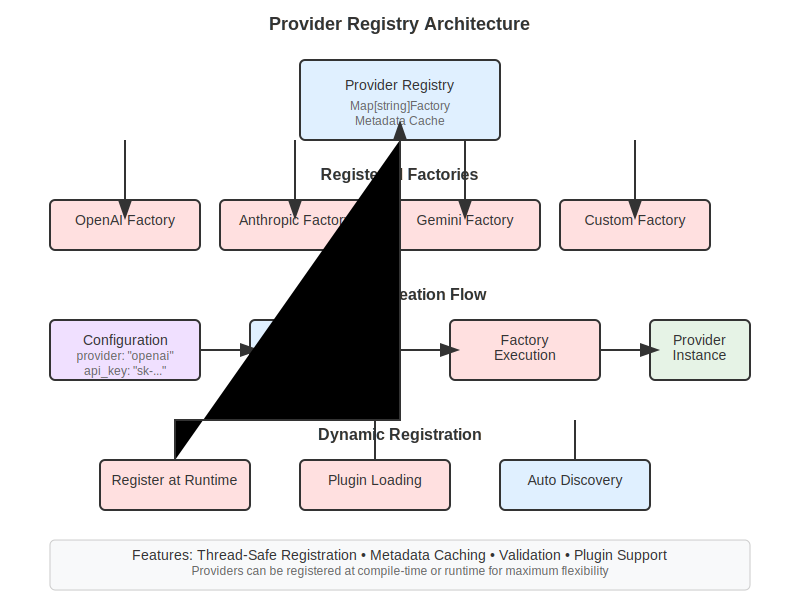
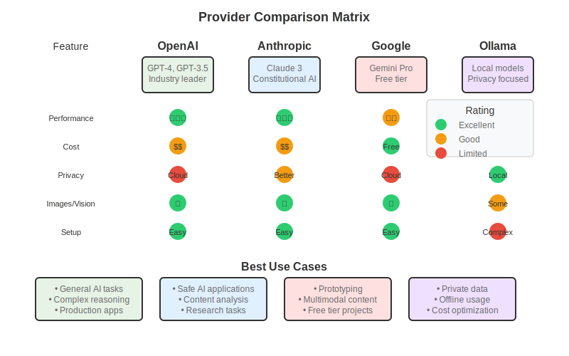
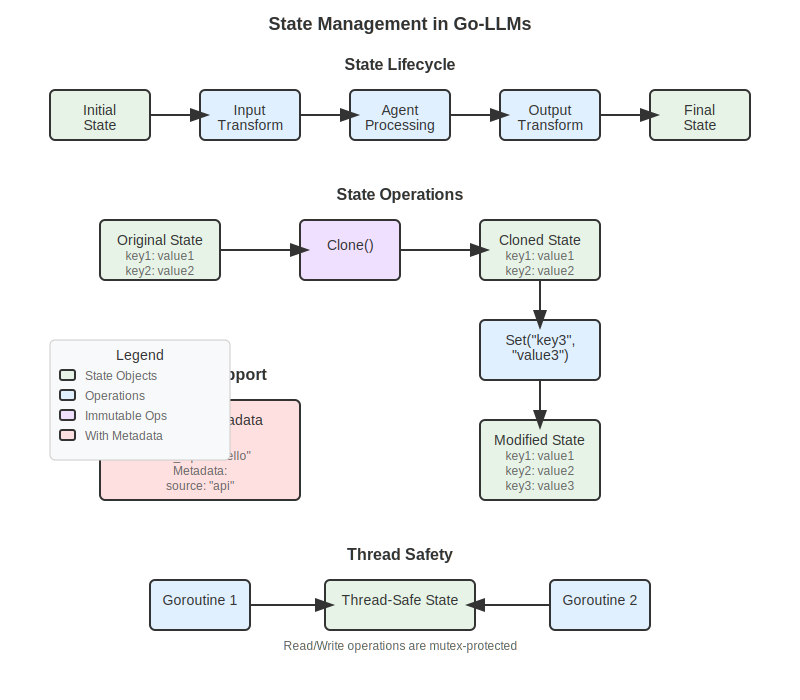

# Key Concepts

> **[User Guide](../README.md) / Getting Started / Key Concepts**

Understanding these five core concepts will help you build powerful AI applications with go-llms. Each concept builds on the previous ones, so we recommend reading them in order.

## 1. Providers - Your AI Connection

**Providers** are your connection to AI services like OpenAI, Anthropic, Google, and Ollama. Think of them as drivers that translate your requests into API calls.


*How providers work: Unified interface to different AI services*

### Why Providers Matter

- **Unified Interface**: Same code works with different AI services
- **Easy Switching**: Change from GPT-4 to Claude with one line
- **Built-in Reliability**: Automatic retries, rate limiting, error handling

### Quick Example

```go
// Create different providers with the same interface
openai := provider.NewOpenAIProvider(apiKey, "gpt-4")
claude := provider.NewAnthropicProvider(apiKey, "claude-3-sonnet-20240229")
gemini := provider.NewGoogleProvider(apiKey, "gemini-pro")

// All work the same way
response, err := openai.Generate(ctx, "Hello!")
response, err := claude.Generate(ctx, "Hello!")
response, err := gemini.Generate(ctx, "Hello!")
```

### When to Use Which Provider


*Comparison of different AI providers and their strengths*

## 2. Messages - How You Talk to AI

**Messages** represent conversations with AI. They contain the text, role (user/assistant/system), and optional media content.

### Message Structure

```go
// Simple text message
message := domain.NewMessage(domain.RoleUser, "What is the weather like?")

// Message with system context
systemMsg := domain.NewMessage(domain.RoleSystem, "You are a helpful weather assistant")
userMsg := domain.NewMessage(domain.RoleUser, "What's the weather in NYC?")

// Multi-turn conversation
conversation := []domain.Message{
    domain.NewMessage(domain.RoleUser, "Hello!"),
    domain.NewMessage(domain.RoleAssistant, "Hi! How can I help you?"),
    domain.NewMessage(domain.RoleUser, "What's 2+2?"),
}
```

### Message Roles

- **System**: Instructions for the AI (how to behave)
- **User**: Messages from the person using your app
- **Assistant**: Responses from the AI

## 3. Schemas - Reliable Data Structure

**Schemas** ensure you get structured, reliable data from AI instead of unpredictable text. They use JSON Schema for validation.

### Why Use Schemas?


*How schemas ensure reliable data structure from AI responses*

### Schema Example

```go
// Define what you want
weatherSchema := &schema.Schema{
    Type: "object",
    Properties: map[string]*schema.Schema{
        "condition": {Type: "string"},
        "temperature": {Type: "number"},
        "wind_speed": {Type: "number"},
    },
    Required: []string{"condition", "temperature"},
}

// Get structured data
result, err := provider.GenerateWithSchema(ctx, 
    "What's the weather in NYC?", 
    weatherSchema)

// result is guaranteed to match your schema
weatherData := result.(*WeatherData)
fmt.Printf("It's %s and %v°F", weatherData.Condition, weatherData.Temperature)
```

### Common Schema Patterns

```go
// Data extraction
extractionSchema := &schema.Schema{
    Type: "object",
    Properties: map[string]*schema.Schema{
        "name": {Type: "string"},
        "email": {Type: "string", Format: "email"},
        "age": {Type: "integer", Minimum: ptr(0)},
    },
}

// Classification
classificationSchema := &schema.Schema{
    Type: "string",
    Enum: []interface{}{"positive", "negative", "neutral"},
}

// Lists
listSchema := &schema.Schema{
    Type: "array",
    Items: &schema.Schema{
        Type: "object",
        Properties: map[string]*schema.Schema{
            "task": {Type: "string"},
            "priority": {Type: "string", Enum: []interface{}{"high", "medium", "low"}},
        },
    },
}
```

## 4. Agents - Your AI Workers

**Agents** are intelligent workers that can use tools, manage conversations, and coordinate with other agents. They're the main way you build AI applications.


*Different types of agents and how they work together*

### Types of Agents

#### LLM Agent - Conversational AI
```go
// Create an LLM agent
agent := core.NewLLMAgent("assistant", "gpt-4", core.LLMDeps{
    Provider: openaiProvider,
}

// Configure behavior
agent.SetSystemPrompt("You are a helpful coding assistant")
agent.SetMaxIterations(5)

// Add capabilities
agent.AddTool(calculatorTool)
agent.AddTool(webSearchTool)
```

#### Sequential Agent - Step-by-Step Processing
```go
// Create a workflow that runs agents in order
workflow := workflow.NewSequentialAgent("data-processor", []domain.BaseAgent{
    extractorAgent,    // First: extract data from text
    validatorAgent,    // Second: validate the extracted data  
    formatterAgent,    // Third: format for output
}
```

#### Parallel Agent - Concurrent Processing
```go
// Run multiple agents at the same time
parallelAgent := workflow.NewParallelAgent("multi-analyzer", []domain.BaseAgent{
    sentimentAgent,    // Analyze sentiment
    entityAgent,       // Extract entities
    summaryAgent,      // Create summary
}
```

### When to Use Each Agent Type

| Agent Type | Use When | Example |
|------------|----------|---------|
| **LLM Agent** | Need conversation, tools, reasoning | Chatbot, assistant, Q&A |
| **Sequential** | Step-by-step processing | Data pipeline, document processing |
| **Parallel** | Independent tasks | Multi-analysis, comparison, validation |
| **Conditional** | Logic-based routing | Content moderation, classification |
| **Loop** | Iterative improvement | Quality refinement, optimization |

## 5. State - Your Data Pipeline

**State** is how data flows through your agents. It's a thread-safe container that carries information from one step to the next.


*How state flows through agents and tools*

### State Operations

```go
// Create state
state := domain.NewState()

// Add data
state.Set("user_input", "Process this text")
state.Set("document", documentContent)
state.Set("preferences", userPreferences)

// Read data (safe, won't crash if missing)
text, exists := state.Get("user_input")
if exists {
    fmt.Println("Processing:", text)
}

// Modify state (creates a copy for safety)
newState := state.Clone()
newState.Set("processed", true)
newState.Set("result", processedData)

// Add metadata
state.SetMetadata("source", "web-upload")
state.SetMetadata("timestamp", time.Now())
```

### State Flow Patterns

#### Linear Flow
```go
// Data flows from agent to agent
state.Set("raw_text", "User uploaded document...")

result1, _ := extractorAgent.Run(ctx, state)     // Extracts entities
result2, _ := validatorAgent.Run(ctx, result1)   // Validates entities  
result3, _ := formatterAgent.Run(ctx, result2)   // Formats output

finalOutput, _ := result3.Get("formatted_output")
```

#### Accumulative Flow
```go
// Multiple agents add to the same state
state.Set("document", document)

state, _ = sentimentAgent.Run(ctx, state)    // Adds "sentiment"
state, _ = entityAgent.Run(ctx, state)       // Adds "entities"  
state, _ = summaryAgent.Run(ctx, state)      // Adds "summary"

// Now state contains: document, sentiment, entities, summary
```

## Putting It All Together

Here's how all concepts work together in a real application:

```go
func main() {
    // 1. Create a provider
    provider := provider.NewOpenAIProvider(apiKey, "gpt-4")
    
    // 2. Create an agent
    agent := core.NewLLMAgent("analyzer", "gpt-4", core.LLMDeps{
        Provider: provider,
}
    
    // 3. Define what you want (schema)
    analysisSchema := &schema.Schema{
        Type: "object",
        Properties: map[string]*schema.Schema{
            "sentiment": {Type: "string", Enum: []interface{}{"positive", "negative", "neutral"}},
            "confidence": {Type: "number"},
            "key_points": {Type: "array", Items: &schema.Schema{Type: "string"}},
        },
    }
    
    // 4. Configure the agent
    agent.SetSystemPrompt("Analyze text and return structured data")
    agent.SetSchema(analysisSchema)
    
    // 5. Process data through state
    state := domain.NewState()
    state.Set("user_input", "I love this new product! It's amazing and works perfectly.")
    
    // 6. Run and get structured results
    result, err := agent.Run(context.Background(), state)
    if err != nil {
        log.Fatal(err)
    }
    
    // 7. Use the structured output
    analysis, _ := result.Get("structured_output")
    fmt.Printf("Analysis: %+v\n", analysis)
    // Output: Analysis: {sentiment: "positive", confidence: 0.95, key_points: ["loves product", "works perfectly"]}
}
```

## Key Takeaways

1. **Providers** connect you to AI services with a unified interface
2. **Messages** structure your conversations with AI
3. **Schemas** ensure reliable, structured data output
4. **Agents** are intelligent workers that can use tools and coordinate
5. **State** carries data through your application pipeline

## What's Next?

Now that you understand the core concepts:

- **[First Steps](first-steps.md)** - Build 3 progressively complex programs
- **[Provider Setup](choosing-providers.md)** - Choose and configure your AI provider
- **[Building Chat Apps](../guides/building-chat-apps.md)** - Create your first real application
- **[Beginner Projects](../examples/beginner-projects.md)** - Try hands-on projects

## Quick Reference

```go
// Provider → Agent → State → Result pattern
provider := provider.NewOpenAIProvider(apiKey, model)
agent := core.NewLLMAgent(name, model, core.LLMDeps{Provider: provider})
state := domain.NewState()
state.Set("user_input", input)
result, err := agent.Run(ctx, state)
output, _ := result.Get("response")
```

---

**Concepts clear?** → [Build your first 3 programs](first-steps.md) | **Want to explore?** → [Choose a provider](choosing-providers.md)