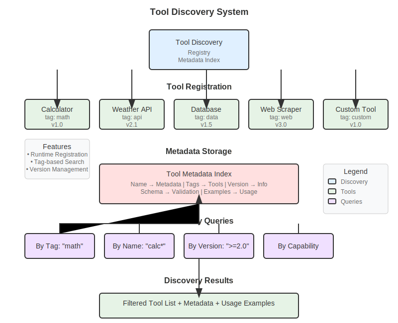

# Agent Tools: Using and Creating Tools Effectively

> **[Project Root](/) / [Documentation](/docs/) / [User Guide](/docs/user-guide/) / [Guides](/docs/user-guide/guides/) / Agent Tools**

Supercharge your agents with powerful tools. Learn to use Go-LLMs' 30+ built-in tools and create custom tools for specialized tasks. From simple calculations to complex API integrations.

## Why Agent Tools Matter

- **Real-World Interaction** - Agents that can search, calculate, read files, and call APIs
- **Reliability** - Tools provide deterministic results when LLMs need precision
- **Extensibility** - Add custom capabilities specific to your domain
- **Composition** - Combine tools to create complex workflows
- **Production Ready** - Built-in error handling, validation, and monitoring

## Built-in Tool Categories

Go-LLMs provides 30+ production-ready tools across 6 categories:



| Category | Purpose | Example Tools | Use Cases |
|----------|---------|---------------|-----------|
| **Web** | Internet interaction | Search, Fetch, Scrape, HTTP, APIs | Research, monitoring, integrations |
| **File** | File operations | Read, Write, Search, List | Document processing, data storage |
| **Math** | Calculations | Calculator, Statistics | Financial analysis, data science |
| **System** | System interaction | Execute, Environment, Processes | Automation, monitoring, deployment |
| **Data** | Data processing | JSON, CSV, XML, Transform | ETL, validation, format conversion |
| **DateTime** | Time operations | Parse, Format, Calculate | Scheduling, logging, analytics |

## Prerequisites

- [Creating Agents guide completed](creating-agents.md) ✅
- Basic understanding of tool concepts ✅
- Go interface knowledge helpful ✅

---

## Level 1: Using Built-in Tools
*Add superpowers to your agents in minutes*

### Web Tools Example
```go
package main

import (
    "context"
    "fmt"
    "log"
    "os"

    "github.com/lexlapax/go-llms/pkg/agent/core"
    "github.com/lexlapax/go-llms/pkg/agent/domain"
    
    // Import web tools
    "github.com/lexlapax/go-llms/pkg/agent/builtins/tools/web"
)

func main() {
    // Create research agent
    agent, err := core.NewAgentFromString("research-agent", "anthropic/claude-3-5-sonnet")
    if err != nil {
        log.Fatalf("Failed to create agent: %v", err)
    }

    agent.SetSystemPrompt(`You are a research assistant with web capabilities.
    When asked questions:
    1. Use web search to find current information
    2. Fetch specific pages for detailed content
    3. Scrape structured data when needed
    4. Always cite your sources
    
    Provide comprehensive, well-sourced answers.`)

    // Add web search tool
    if searchKey := os.Getenv("SEARCH_API_KEY"); searchKey != "" {
        searchTool := web.NewWebSearchTool(searchKey)
        agent.AddTool(searchTool)
        fmt.Println("✓ Web search enabled")
    }

    // Add web fetch tool
    fetchTool := web.NewWebFetchTool()
    agent.AddTool(fetchTool)
    fmt.Println("✓ Web fetch enabled")

    // Add web scraping tool
    scrapeTool := web.NewWebScrapeTool()
    agent.AddTool(scrapeTool)
    fmt.Println("✓ Web scraping enabled")

    // Add HTTP request tool for APIs
    httpTool := web.NewHTTPRequestTool()
    agent.AddTool(httpTool)
    fmt.Println("✓ HTTP requests enabled")

    // Research tasks
    tasks := []string{
        "What's the current stock price of NVIDIA and how has it performed this year?",
        "Find the latest Go language release notes and summarize new features",
        "Get the current weather in Tokyo and New York, compare them",
        "Research the top 3 AI startups that raised funding in 2024",
    }

    state := domain.NewState()

    for i, task := range tasks {
        fmt.Printf("\n--- Research Task %d ---\n", i+1)
        fmt.Printf("Question: %s\n", task)

        state.Set("user_input", task)

        result, err := agent.Run(context.Background(), state)
        if err != nil {
            fmt.Printf("❌ Error: %v\n", err)
            continue
        }

        if response, exists := result.Get("response"); exists {
            fmt.Printf("Research Result: %v\n", response)
        }

        // Show tools used
        if toolCalls, exists := result.Get("tool_calls"); exists {
            fmt.Printf("🔧 Tools used: %v\n", toolCalls)
        }
    }
}
```

### File and Data Tools Example
```go
package main

import (
    "context"
    "fmt"
    "log"

    "github.com/lexlapax/go-llms/pkg/agent/core"
    "github.com/lexlapax/go-llms/pkg/agent/domain"
    
    // Import tool categories
    "github.com/lexlapax/go-llms/pkg/agent/builtins/tools/file"
    "github.com/lexlapax/go-llms/pkg/agent/builtins/tools/data"
    "github.com/lexlapax/go-llms/pkg/agent/builtins/tools/math"
)

func main() {
    // Create data analyst agent
    agent, err := core.NewAgentFromString("data-analyst", "openai/gpt-4o")
    if err != nil {
        log.Fatalf("Failed to create agent: %v", err)
    }

    agent.SetSystemPrompt(`You are a data analyst with file and calculation capabilities.
    You can:
    - Read and write files in various formats
    - Process CSV, JSON, and XML data
    - Perform calculations and statistical analysis
    - Generate reports and summaries
    
    Always validate data before processing and handle errors gracefully.`)

    // Add file tools
    agent.AddTool(file.NewFileReadTool())
    agent.AddTool(file.NewFileWriteTool())
    agent.AddTool(file.NewFileListTool())
    agent.AddTool(file.NewFileSearchTool())
    fmt.Println("✓ File tools enabled")

    // Add data processing tools
    agent.AddTool(data.NewJSONProcessTool())
    agent.AddTool(data.NewCSVProcessTool())
    agent.AddTool(data.NewXMLProcessTool())
    agent.AddTool(data.NewDataTransformTool())
    fmt.Println("✓ Data processing tools enabled")

    // Add math tools
    agent.AddTool(math.NewCalculatorTool())
    fmt.Println("✓ Calculator tool enabled")

    // Create sample data
    sampleCSV := `name,age,department,salary
John Doe,30,Engineering,75000
Jane Smith,28,Marketing,65000
Bob Johnson,35,Engineering,80000
Alice Brown,32,Sales,70000
Charlie Davis,29,Marketing,62000`

    // Data analysis tasks
    tasks := []string{
        fmt.Sprintf("Save this CSV data to a file called 'employees.csv': %s", sampleCSV),
        "Read the employees.csv file and calculate the average salary",
        "Group employees by department and show average salary per department",
        "Find the highest and lowest paid employees",
        "Create a summary report and save it to 'salary_analysis.txt'",
    }

    state := domain.NewState()

    for i, task := range tasks {
        fmt.Printf("\n--- Data Task %d ---\n", i+1)
        fmt.Printf("Task: %s\n", task)

        state.Set("user_input", task)

        result, err := agent.Run(context.Background(), state)
        if err != nil {
            fmt.Printf("❌ Error: %v\n", err)
            continue
        }

        if response, exists := result.Get("response"); exists {
            fmt.Printf("Result: %v\n", response)
        }
    }
}
```

### System and DateTime Tools Example
```go
package main

import (
    "context"
    "fmt"
    "log"

    "github.com/lexlapax/go-llms/pkg/agent/core"
    "github.com/lexlapax/go-llms/pkg/agent/domain"
    
    // Import system and datetime tools
    "github.com/lexlapax/go-llms/pkg/agent/builtins/tools/system"
    "github.com/lexlapax/go-llms/pkg/agent/builtins/tools/datetime"
)

func main() {
    // Create system admin agent
    agent, err := core.NewAgentFromString("sysadmin-agent", "anthropic/claude-3-5-haiku")
    if err != nil {
        log.Fatalf("Failed to create agent: %v", err)
    }

    agent.SetSystemPrompt(`You are a system administrator assistant.
    You can:
    - Check system information and processes
    - Execute system commands safely
    - Work with environment variables
    - Handle date/time operations
    - Generate system reports
    
    Always be cautious with system commands and explain what you're doing.`)

    // Add system tools
    agent.AddTool(system.NewSystemInfoTool())
    agent.AddTool(system.NewProcessListTool())
    agent.AddTool(system.NewEnvVarTool())
    agent.AddTool(system.NewExecuteTool())
    fmt.Println("✓ System tools enabled")

    // Add datetime tools
    agent.AddTool(datetime.NewDateTimeNowTool())
    agent.AddTool(datetime.NewDateTimeFormatTool())
    agent.AddTool(datetime.NewDateTimeParseTool())
    agent.AddTool(datetime.NewDateTimeCalculateTool())
    fmt.Println("✓ DateTime tools enabled")

    // System administration tasks
    tasks := []string{
        "What operating system am I running and what's the current time?",
        "Show me the current Go processes running on this system",
        "What's my PATH environment variable?",
        "Calculate how many days are left until New Year 2025",
        "List the files in the current directory using a system command",
    }

    state := domain.NewState()

    for i, task := range tasks {
        fmt.Printf("\n--- System Task %d ---\n", i+1)
        fmt.Printf("Task: %s\n", task)

        state.Set("user_input", task)

        result, err := agent.Run(context.Background(), state)
        if err != nil {
            fmt.Printf("❌ Error: %v\n", err)
            continue
        }

        if response, exists := result.Get("response"); exists {
            fmt.Printf("Result: %v\n", response)
        }
    }
}
```

---

## Level 2: Tool Discovery and Dynamic Usage
*Discover and use tools at runtime*

### Tool Registry and Discovery
```go
package main

import (
    "context"
    "fmt"
    "log"

    "github.com/lexlapax/go-llms/pkg/agent/core"
    "github.com/lexlapax/go-llms/pkg/agent/domain"
    "github.com/lexlapax/go-llms/pkg/agent/builtins/tools"
    
    // Import all tool categories for registration
    _ "github.com/lexlapax/go-llms/pkg/agent/builtins/tools/web"
    _ "github.com/lexlapax/go-llms/pkg/agent/builtins/tools/file"
    _ "github.com/lexlapax/go-llms/pkg/agent/builtins/tools/math"
    _ "github.com/lexlapax/go-llms/pkg/agent/builtins/tools/system"
    _ "github.com/lexlapax/go-llms/pkg/agent/builtins/tools/data"
    _ "github.com/lexlapax/go-llms/pkg/agent/builtins/tools/datetime"
)

func main() {
    fmt.Println("🔍 Tool Discovery and Dynamic Usage")
    fmt.Println("===================================")

    // Create adaptive agent
    agent, err := core.NewAgentFromString("adaptive-agent", "openai/gpt-4o")
    if err != nil {
        log.Fatalf("Failed to create agent: %v", err)
    }

    agent.SetSystemPrompt(`You are an adaptive agent with dynamic tool capabilities.
    You can discover and use tools as needed for different tasks.
    
    Available tool categories:
    - web: Internet operations (search, fetch, scrape, HTTP)
    - file: File operations (read, write, list, search)
    - math: Calculations and statistics
    - system: System operations (execute, environment, processes)
    - data: Data processing (JSON, CSV, XML, transform)
    - datetime: Date and time operations
    
    Choose appropriate tools for each task and explain your tool selection.`)

    // Discover available tools
    registry := tools.GetGlobalRegistry()
    availableTools := registry.ListTools()

    fmt.Printf("🛠️ Discovered %d tools:\n", len(availableTools))
    
    // Group tools by category
    categories := make(map[string][]string)
    for _, tool := range availableTools {
        metadata := tool.Metadata()
        category := metadata.Category
        if category == "" {
            category = "uncategorized"
        }
        categories[category] = append(categories[category], metadata.Name)
    }

    for category, toolNames := range categories {
        fmt.Printf("  %s: %v\n", category, toolNames)
    }

    // Add tools dynamically based on capabilities needed
    taskRequirements := map[string][]string{
        "research": {"web"},
        "data_analysis": {"file", "data", "math"},
        "system_monitoring": {"system", "datetime"},
        "general": {"web", "file", "math", "datetime"},
    }

    // Add tools for general capabilities
    addedTools := make(map[string]bool)
    for _, category := range taskRequirements["general"] {
        for _, tool := range availableTools {
            metadata := tool.Metadata()
            if metadata.Category == category && !addedTools[metadata.Name] {
                agent.AddTool(tool)
                addedTools[metadata.Name] = true
                fmt.Printf("✓ Added %s tool (%s)\n", metadata.Name, category)
            }
        }
    }

    // Dynamic task execution
    tasks := []struct {
        name        string
        description string
        category    string
    }{
        {
            name:        "Web Research",
            description: "Find the latest news about quantum computing breakthroughs",
            category:    "research",
        },
        {
            name:        "Data Analysis",
            description: "Create a CSV with sample sales data and calculate total revenue",
            category:    "data_analysis",
        },
        {
            name:        "System Check",
            description: "Check system uptime and current memory usage",
            category:    "system_monitoring",
        },
        {
            name:        "Multi-Tool Task",
            description: "Get current time, search for today's tech news, and save summary to file",
            category:    "general",
        },
    }

    state := domain.NewState()

    for i, task := range tasks {
        fmt.Printf("\n--- Dynamic Task %d: %s ---\n", i+1, task.name)
        fmt.Printf("Description: %s\n", task.description)
        fmt.Printf("Expected category: %s\n", task.category)

        state.Set("user_input", task.description)

        result, err := agent.Run(context.Background(), state)
        if err != nil {
            fmt.Printf("❌ Error: %v\n", err)
            continue
        }

        if response, exists := result.Get("response"); exists {
            fmt.Printf("Result: %v\n", response)
        }

        // Show which tools were actually used
        if toolCalls, exists := result.Get("tool_calls"); exists {
            fmt.Printf("🔧 Tools used: %v\n", toolCalls)
        }
    }
}
```

---

## Level 3: Creating Custom Tools
*Build specialized tools for your domain*

### Simple Custom Tool
```go
package main

import (
    "context"
    "encoding/json"
    "fmt"
    "log"
    "strconv"
    "strings"

    "github.com/lexlapax/go-llms/pkg/agent/core"
    "github.com/lexlapax/go-llms/pkg/agent/domain"
)

// PasswordGeneratorTool generates secure passwords
type PasswordGeneratorTool struct {
    name        string
    description string
}

// NewPasswordGeneratorTool creates a new password generator tool
func NewPasswordGeneratorTool() *PasswordGeneratorTool {
    return &PasswordGeneratorTool{
        name:        "password_generator",
        description: "Generate secure passwords with customizable criteria",
    }
}

// Name returns the tool name
func (p *PasswordGeneratorTool) Name() string {
    return p.name
}

// Description returns the tool description
func (p *PasswordGeneratorTool) Description() string {
    return p.description
}

// Parameters returns the tool parameters schema
func (p *PasswordGeneratorTool) Parameters() map[string]interface{} {
    return map[string]interface{}{
        "type": "object",
        "properties": map[string]interface{}{
            "length": map[string]interface{}{
                "type":        "integer",
                "description": "Password length (8-128 characters)",
                "minimum":     8,
                "maximum":     128,
                "default":     12,
            },
            "include_uppercase": map[string]interface{}{
                "type":        "boolean",
                "description": "Include uppercase letters",
                "default":     true,
            },
            "include_lowercase": map[string]interface{}{
                "type":        "boolean",
                "description": "Include lowercase letters",
                "default":     true,
            },
            "include_numbers": map[string]interface{}{
                "type":        "boolean",
                "description": "Include numbers",
                "default":     true,
            },
            "include_symbols": map[string]interface{}{
                "type":        "boolean",
                "description": "Include special symbols",
                "default":     false,
            },
            "exclude_ambiguous": map[string]interface{}{
                "type":        "boolean",
                "description": "Exclude ambiguous characters (0, O, l, 1, etc.)",
                "default":     true,
            },
        },
        "required": []string{},
    }
}

// Execute runs the password generator tool
func (p *PasswordGeneratorTool) Execute(ctx context.Context, toolCtx *domain.ToolContext) (*domain.ToolResult, error) {
    // Parse parameters
    params := toolCtx.Parameters
    
    length := 12
    if l, exists := params["length"]; exists {
        if lengthFloat, ok := l.(float64); ok {
            length = int(lengthFloat)
        } else if lengthStr, ok := l.(string); ok {
            if parsed, err := strconv.Atoi(lengthStr); err == nil {
                length = parsed
            }
        }
    }

    includeUpper := getBoolParam(params, "include_uppercase", true)
    includeLower := getBoolParam(params, "include_lowercase", true)
    includeNumbers := getBoolParam(params, "include_numbers", true)
    includeSymbols := getBoolParam(params, "include_symbols", false)
    excludeAmbiguous := getBoolParam(params, "exclude_ambiguous", true)

    // Validate length
    if length < 8 || length > 128 {
        return &domain.ToolResult{
            Content: "Error: Password length must be between 8 and 128 characters",
            Error:   fmt.Errorf("invalid password length: %d", length),
        }, nil
    }

    // Build character sets
    var charset strings.Builder
    
    if includeUpper {
        if excludeAmbiguous {
            charset.WriteString("ABCDEFGHJKMNPQRSTUVWXYZ") // Exclude I, L, O
        } else {
            charset.WriteString("ABCDEFGHIJKLMNOPQRSTUVWXYZ")
        }
    }
    
    if includeLower {
        if excludeAmbiguous {
            charset.WriteString("abcdefghijkmnpqrstuvwxyz") // Exclude l
        } else {
            charset.WriteString("abcdefghijklmnopqrstuvwxyz")
        }
    }
    
    if includeNumbers {
        if excludeAmbiguous {
            charset.WriteString("23456789") // Exclude 0, 1
        } else {
            charset.WriteString("0123456789")
        }
    }
    
    if includeSymbols {
        charset.WriteString("!@#$%^&*-_+=")
    }

    if charset.Len() == 0 {
        return &domain.ToolResult{
            Content: "Error: No character types selected",
            Error:   fmt.Errorf("no character types selected"),
        }, nil
    }

    // Generate password (simplified - use crypto/rand in production)
    chars := charset.String()
    password := make([]byte, length)
    for i := range password {
        password[i] = chars[i%len(chars)] // Simplified for example
    }

    // Create result
    result := map[string]interface{}{
        "password": string(password),
        "length":   length,
        "strength": calculatePasswordStrength(string(password)),
        "criteria": map[string]bool{
            "uppercase":        includeUpper,
            "lowercase":        includeLower,
            "numbers":          includeNumbers,
            "symbols":          includeSymbols,
            "exclude_ambiguous": excludeAmbiguous,
        },
    }

    resultJSON, _ := json.MarshalIndent(result, "", "  ")

    return &domain.ToolResult{
        Content: string(resultJSON),
        Metadata: map[string]interface{}{
            "tool_used":        p.name,
            "password_length":  length,
            "generation_time":  "instant",
        },
    }, nil
}

// Metadata returns tool metadata
func (p *PasswordGeneratorTool) Metadata() domain.ToolMetadata {
    return domain.ToolMetadata{
        Name:        p.name,
        Description: p.description,
        Category:    "security",
        Tags:        []string{"password", "security", "generator"},
        Version:     "1.0.0",
        Author:      "Custom Tools",
    }
}

// Helper functions
func getBoolParam(params map[string]interface{}, key string, defaultValue bool) bool {
    if val, exists := params[key]; exists {
        if boolVal, ok := val.(bool); ok {
            return boolVal
        }
    }
    return defaultValue
}

func calculatePasswordStrength(password string) string {
    score := 0
    
    if len(password) >= 12 {
        score += 2
    } else if len(password) >= 8 {
        score += 1
    }
    
    if strings.ContainsAny(password, "ABCDEFGHIJKLMNOPQRSTUVWXYZ") {
        score += 1
    }
    if strings.ContainsAny(password, "abcdefghijklmnopqrstuvwxyz") {
        score += 1
    }
    if strings.ContainsAny(password, "0123456789") {
        score += 1
    }
    if strings.ContainsAny(password, "!@#$%^&*-_+=") {
        score += 2
    }
    
    switch {
    case score >= 6:
        return "very_strong"
    case score >= 4:
        return "strong"
    case score >= 3:
        return "moderate"
    default:
        return "weak"
    }
}

func main() {
    fmt.Println("🔐 Custom Password Generator Tool")
    fmt.Println("================================")

    // Create security agent
    agent, err := core.NewAgentFromString("security-agent", "openai/gpt-4o-mini")
    if err != nil {
        log.Fatalf("Failed to create agent: %v", err)
    }

    agent.SetSystemPrompt(`You are a cybersecurity assistant.
    You can generate secure passwords based on specific requirements.
    
    When generating passwords:
    - Recommend appropriate length based on use case
    - Suggest security best practices
    - Explain password strength criteria
    - Provide usage recommendations`)

    // Add custom password generator tool
    passwordTool := NewPasswordGeneratorTool()
    agent.AddTool(passwordTool)
    fmt.Println("✓ Custom password generator tool added")

    // Password generation requests
    requests := []string{
        "Generate a 16-character password for my banking account with high security",
        "Create a moderately secure password for a website signup, 12 characters",
        "I need a 20-character password with symbols for my encrypted drive",
        "Generate a simple 8-character password without symbols for legacy system",
    }

    state := domain.NewState()

    for i, request := range requests {
        fmt.Printf("\n--- Password Request %d ---\n", i+1)
        fmt.Printf("Request: %s\n", request)

        state.Set("user_input", request)

        result, err := agent.Run(context.Background(), state)
        if err != nil {
            fmt.Printf("❌ Error: %v\n", err)
            continue
        }

        if response, exists := result.Get("response"); exists {
            fmt.Printf("Security Assistant: %v\n", response)
        }
    }
}
```

### Advanced Custom Tool with External API
```go
package main

import (
    "context"
    "encoding/json"
    "fmt"
    "log"
    "net/http"
    "net/url"
    "time"

    "github.com/lexlapax/go-llms/pkg/agent/core"
    "github.com/lexlapax/go-llms/pkg/agent/domain"
)

// WeatherAPITool fetches weather information from external API
type WeatherAPITool struct {
    name        string
    description string
    apiKey      string
    httpClient  *http.Client
}

// WeatherData represents weather information
type WeatherData struct {
    Location    string  `json:"location"`
    Temperature float64 `json:"temperature"`
    Condition   string  `json:"condition"`
    Humidity    int     `json:"humidity"`
    WindSpeed   float64 `json:"wind_speed"`
    Pressure    float64 `json:"pressure"`
    Visibility  float64 `json:"visibility"`
    UVIndex     int     `json:"uv_index"`
    Timestamp   string  `json:"timestamp"`
}

// NewWeatherAPITool creates a new weather API tool
func NewWeatherAPITool(apiKey string) *WeatherAPITool {
    return &WeatherAPITool{
        name:        "weather_api",
        description: "Get current weather information for any location worldwide",
        apiKey:      apiKey,
        httpClient: &http.Client{
            Timeout: 30 * time.Second,
        },
    }
}

// Name returns the tool name
func (w *WeatherAPITool) Name() string {
    return w.name
}

// Description returns the tool description
func (w *WeatherAPITool) Description() string {
    return w.description
}

// Parameters returns the tool parameters schema
func (w *WeatherAPITool) Parameters() map[string]interface{} {
    return map[string]interface{}{
        "type": "object",
        "properties": map[string]interface{}{
            "location": map[string]interface{}{
                "type":        "string",
                "description": "City name, country (e.g., 'Tokyo, Japan' or 'New York, USA')",
            },
            "units": map[string]interface{}{
                "type":        "string",
                "description": "Temperature units: 'celsius', 'fahrenheit', or 'kelvin'",
                "enum":        []string{"celsius", "fahrenheit", "kelvin"},
                "default":     "celsius",
            },
            "include_forecast": map[string]interface{}{
                "type":        "boolean",
                "description": "Include 24-hour forecast",
                "default":     false,
            },
        },
        "required": []string{"location"},
    }
}

// Execute runs the weather API tool
func (w *WeatherAPITool) Execute(ctx context.Context, toolCtx *domain.ToolContext) (*domain.ToolResult, error) {
    // Parse parameters
    params := toolCtx.Parameters
    
    location, exists := params["location"]
    if !exists {
        return &domain.ToolResult{
            Content: "Error: Location parameter is required",
            Error:   fmt.Errorf("missing location parameter"),
        }, nil
    }

    locationStr := fmt.Sprintf("%v", location)
    units := "celsius"
    if u, exists := params["units"]; exists {
        units = fmt.Sprintf("%v", u)
    }

    includeForecast := false
    if f, exists := params["include_forecast"]; exists {
        if forecast, ok := f.(bool); ok {
            includeForecast = forecast
        }
    }

    // Check if API key is available
    if w.apiKey == "" {
        // Return mock data when no API key is available
        return w.getMockWeatherData(locationStr, units, includeForecast)
    }

    // Make API request (simplified - replace with actual weather API)
    weatherData, err := w.fetchWeatherData(ctx, locationStr, units)
    if err != nil {
        return &domain.ToolResult{
            Content: fmt.Sprintf("Error fetching weather data: %v", err),
            Error:   err,
        }, nil
    }

    // Format response
    result := map[string]interface{}{
        "current": weatherData,
        "units":   units,
        "location": locationStr,
        "timestamp": time.Now().Format(time.RFC3339),
    }

    if includeForecast {
        result["forecast"] = "24-hour forecast data would be included here"
    }

    resultJSON, _ := json.MarshalIndent(result, "", "  ")

    return &domain.ToolResult{
        Content: string(resultJSON),
        Metadata: map[string]interface{}{
            "tool_used":    w.name,
            "location":     locationStr,
            "units":        units,
            "data_source":  "weather_api",
            "cache_ttl":    300, // 5 minutes
        },
    }, nil
}

// fetchWeatherData fetches real weather data from API
func (w *WeatherAPITool) fetchWeatherData(ctx context.Context, location, units string) (*WeatherData, error) {
    // This is where you'd make the actual API call
    // For example: OpenWeatherMap, WeatherAPI, etc.
    
    // Simulated API call
    baseURL := "https://api.example-weather.com/current"
    params := url.Values{}
    params.Add("location", location)
    params.Add("units", units)
    params.Add("apikey", w.apiKey)
    
    fullURL := baseURL + "?" + params.Encode()
    
    req, err := http.NewRequestWithContext(ctx, "GET", fullURL, nil)
    if err != nil {
        return nil, fmt.Errorf("failed to create request: %w", err)
    }

    resp, err := w.httpClient.Do(req)
    if err != nil {
        return nil, fmt.Errorf("API request failed: %w", err)
    }
    defer resp.Body.Close()

    if resp.StatusCode != http.StatusOK {
        return nil, fmt.Errorf("API returned status %d", resp.StatusCode)
    }

    // Parse API response
    var weatherData WeatherData
    if err := json.NewDecoder(resp.Body).Decode(&weatherData); err != nil {
        return nil, fmt.Errorf("failed to parse response: %w", err)
    }

    return &weatherData, nil
}

// getMockWeatherData returns mock weather data for testing
func (w *WeatherAPITool) getMockWeatherData(location, units string, includeForecast bool) (*domain.ToolResult, error) {
    // Mock weather data for demonstration
    mockData := &WeatherData{
        Location:    location,
        Temperature: 22.5,
        Condition:   "Partly Cloudy",
        Humidity:    65,
        WindSpeed:   12.3,
        Pressure:    1013.2,
        Visibility:  10.0,
        UVIndex:     5,
        Timestamp:   time.Now().Format(time.RFC3339),
    }

    // Adjust temperature based on units
    switch units {
    case "fahrenheit":
        mockData.Temperature = mockData.Temperature*9/5 + 32
    case "kelvin":
        mockData.Temperature = mockData.Temperature + 273.15
    }

    result := map[string]interface{}{
        "current":   mockData,
        "units":     units,
        "location":  location,
        "timestamp": time.Now().Format(time.RFC3339),
        "note":      "Mock data - set WEATHER_API_KEY environment variable for real data",
    }

    if includeForecast {
        result["forecast"] = []map[string]interface{}{
            {"time": "+3h", "temp": mockData.Temperature + 2, "condition": "Sunny"},
            {"time": "+6h", "temp": mockData.Temperature + 5, "condition": "Clear"},
            {"time": "+12h", "temp": mockData.Temperature - 3, "condition": "Cloudy"},
        }
    }

    resultJSON, _ := json.MarshalIndent(result, "", "  ")

    return &domain.ToolResult{
        Content: string(resultJSON),
        Metadata: map[string]interface{}{
            "tool_used":   w.name,
            "location":    location,
            "units":       units,
            "data_source": "mock",
            "cache_ttl":   60,
        },
    }, nil
}

// Metadata returns tool metadata
func (w *WeatherAPITool) Metadata() domain.ToolMetadata {
    return domain.ToolMetadata{
        Name:        w.name,
        Description: w.description,
        Category:    "weather",
        Tags:        []string{"weather", "api", "location", "forecast"},
        Version:     "1.0.0",
        Author:      "Custom Tools",
        RequiresAuth: w.apiKey != "",
        RateLimits: map[string]interface{}{
            "requests_per_minute": 60,
            "requests_per_day":    1000,
        },
    }
}

func main() {
    fmt.Println("🌤️ Advanced Weather API Tool")
    fmt.Println("=============================")

    // Create weather agent
    agent, err := core.NewAgentFromString("weather-agent", "anthropic/claude-3-5-haiku")
    if err != nil {
        log.Fatalf("Failed to create agent: %v", err)
    }

    agent.SetSystemPrompt(`You are a weather information assistant.
    You provide current weather information and forecasts for any location.
    
    When providing weather information:
    - Always include the location and timestamp
    - Explain weather conditions in user-friendly terms
    - Provide relevant advice based on conditions
    - Suggest appropriate clothing or activities
    - Include units clearly (Celsius, Fahrenheit, etc.)`)

    // Add weather tool (with optional API key)
    apiKey := "" // Set from environment in production
    weatherTool := NewWeatherAPITool(apiKey)
    agent.AddTool(weatherTool)
    fmt.Println("✓ Weather API tool added")

    // Weather requests
    requests := []string{
        "What's the current weather in Tokyo, Japan?",
        "Check the weather in New York City in Fahrenheit",
        "Get weather for London, UK with 24-hour forecast",
        "What's the weather like in Sydney, Australia?",
    }

    state := domain.NewState()

    for i, request := range requests {
        fmt.Printf("\n--- Weather Request %d ---\n", i+1)
        fmt.Printf("Request: %s\n", request)

        state.Set("user_input", request)

        result, err := agent.Run(context.Background(), state)
        if err != nil {
            fmt.Printf("❌ Error: %v\n", err)
            continue
        }

        if response, exists := result.Get("response"); exists {
            fmt.Printf("Weather Assistant: %v\n", response)
        }
    }
}
```

---

## Level 4: Tool Composition and Workflows
*Combine tools to create powerful workflows*

### Tool Orchestration Example
```go
package main

import (
    "context"
    "fmt"
    "log"

    "github.com/lexlapax/go-llms/pkg/agent/core"
    "github.com/lexlapax/go-llms/pkg/agent/domain"
    "github.com/lexlapax/go-llms/pkg/agent/builtins/tools/web"
    "github.com/lexlapax/go-llms/pkg/agent/builtins/tools/file"
    "github.com/lexlapax/go-llms/pkg/agent/builtins/tools/math"
    "github.com/lexlapax/go-llms/pkg/agent/builtins/tools/datetime"
)

func main() {
    fmt.Println("🔄 Tool Composition and Workflows")
    fmt.Println("=================================")

    // Create orchestrator agent
    agent, err := core.NewAgentFromString("orchestrator", "openai/gpt-4o")
    if err != nil {
        log.Fatalf("Failed to create agent: %v", err)
    }

    agent.SetSystemPrompt(`You are a workflow orchestrator with access to multiple tools.
    You can combine tools to accomplish complex tasks:
    
    Available tools:
    - Web tools: Search, fetch web content
    - File tools: Read, write, manage files
    - Math tools: Calculations and analysis
    - DateTime tools: Time operations
    
    For complex requests:
    1. Break down the task into steps
    2. Use appropriate tools for each step
    3. Combine results logically
    4. Save important information to files
    5. Provide comprehensive summaries
    
    Always explain your workflow and tool selection.`)

    // Add comprehensive tool set
    if searchKey := os.Getenv("SEARCH_API_KEY"); searchKey != "" {
        agent.AddTool(web.NewWebSearchTool(searchKey))
        fmt.Println("✓ Web search enabled")
    }
    
    agent.AddTool(web.NewWebFetchTool())
    agent.AddTool(file.NewFileWriteTool())
    agent.AddTool(file.NewFileReadTool())
    agent.AddTool(math.NewCalculatorTool())
    agent.AddTool(datetime.NewDateTimeNowTool())
    agent.AddTool(datetime.NewDateTimeCalculateTool())
    fmt.Println("✓ Multi-tool environment ready")

    // Complex workflow tasks
    workflows := []string{
        `Research the top 3 programming languages by popularity in 2024, 
         calculate the percentage market share for each, 
         and save a detailed report to 'programming_languages_2024.txt' with timestamp`,

        `Find the current time, calculate how many days until Christmas 2024, 
         search for Christmas gift ideas for programmers, 
         and create a shopping timeline saved to 'christmas_plan.txt'`,

        `Look up the latest Go language version, 
         calculate the time since Go 1.0 was released (March 28, 2012), 
         search for new features in the latest version, 
         and create a version comparison report saved to 'go_evolution.txt'`,
    }

    state := domain.NewState()

    for i, workflow := range workflows {
        fmt.Printf("\n--- Complex Workflow %d ---\n", i+1)
        fmt.Printf("Task: %s\n", workflow)
        fmt.Println("---")

        state.Set("user_input", workflow)

        result, err := agent.Run(context.Background(), state)
        if err != nil {
            fmt.Printf("❌ Workflow failed: %v\n", err)
            continue
        }

        if response, exists := result.Get("response"); exists {
            fmt.Printf("Orchestrator: %v\n", response)
        }

        // Show workflow completion
        fmt.Println("✅ Workflow completed - check generated files for detailed results")
    }
}
```

## Tool Best Practices

### 1. Tool Selection
- **Start Simple** - Begin with built-in tools before creating custom ones
- **Match Purpose** - Choose tools that fit your specific use case
- **Consider Reliability** - Prefer tools with good error handling
- **Think Composition** - Select tools that work well together

### 2. Custom Tool Development
- **Clear Interface** - Implement all required methods properly
- **Parameter Validation** - Validate inputs thoroughly
- **Error Handling** - Return meaningful error messages
- **Documentation** - Provide clear descriptions and examples

### 3. Error Handling
- **Graceful Degradation** - Handle tool failures gracefully
- **Retry Logic** - Implement intelligent retry mechanisms
- **Fallback Options** - Provide alternative approaches
- **User Feedback** - Give clear feedback about tool issues

### 4. Performance
- **Caching** - Cache expensive tool operations
- **Timeouts** - Set appropriate timeouts for external calls
- **Rate Limiting** - Respect API rate limits
- **Resource Management** - Clean up resources properly

## Troubleshooting

### Common Issues

**Tool Not Found**
- Verify tool registration and imports
- Check tool name spelling and case
- Ensure proper initialization
- Review agent tool addition

**Parameter Errors**
- Validate parameter schema definition
- Check parameter types and formats
- Test with various input combinations
- Review parameter documentation

**External API Issues**
- Check API keys and authentication
- Verify network connectivity
- Handle rate limiting and quotas
- Implement proper error handling

**Performance Problems**
- Profile tool execution times
- Implement caching where appropriate
- Optimize external API calls
- Monitor resource usage

## Next Steps

🛠️ **Ready to master tools?** Explore these advanced topics:

- **[Agent Communication](agent-communication.md)** - Multi-agent tool coordination
- **[Building Research Agents](building-research-agents.md)** - Specialized tool usage patterns
- **[Custom Tools Development](../advanced/custom-tools.md)** - Advanced tool creation
- **[Web Applications](web-applications.md)** - Tool integration in web apps

### Related Examples

- **[Built-in Tools Discovery](../../cmd/examples/builtins-discovery/)** - Explore all built-in tools
- **[Built-in Web Tools](../../cmd/examples/builtins-web-tools/)** - Web tool examples
- **[Built-in Data Tools](../../cmd/examples/builtins-data-tools/)** - Data processing tools
- **[Agent Built-in Tools](../../cmd/examples/agent-llm-builtin-tools/)** - Agent-tool integration

### Tool Categories Reference

- **[Built-in Tools Reference](../reference/built-in-tools-reference.md)** - Complete tool catalog
- **[API Reference](../reference/api-quick-reference.md)** - Tool API patterns
- **[Configuration Reference](../reference/configuration-reference.md)** - Tool configuration options

---

**Need help?** Check our [troubleshooting guide](../advanced/troubleshooting.md) or join the discussion on [GitHub](https://github.com/lexlapax/go-llms/discussions).