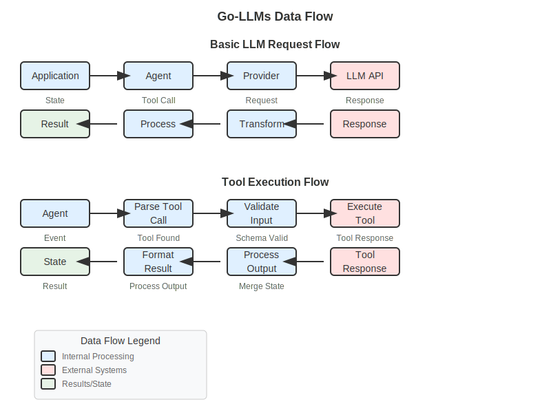
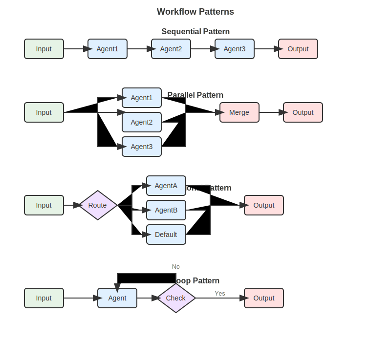

# API Quick Reference

> **[User Guide](../README.md) / Reference / API Quick Reference**

Essential API calls and patterns for go-llms. Perfect for quick lookups during development.

## Core Pattern


*The fundamental data flow pattern in go-llms: Provider → Agent → State → Result*

```go
// Basic pattern: Provider → Agent → State → Result
provider := provider.NewOpenAIProvider(apiKey, model)
agent := core.NewLLMAgent(name, model, core.LLMDeps{Provider: provider})
state := domain.NewState()
state.Set("user_input", input)
result, err := agent.Run(ctx, state)
output, _ := result.Get("response")
```

## Quick Setup

### 1. Import Packages
```go
import (
    "context"
    "github.com/lexlapax/go-llms/pkg/llm/provider"
    "github.com/lexlapax/go-llms/pkg/agent/core"
    "github.com/lexlapax/go-llms/pkg/llm/domain"
    "github.com/lexlapax/go-llms/pkg/schema"
)
```

### 2. Provider Creation
```go
// OpenAI
openai := provider.NewOpenAIProvider("sk-...", "gpt-4")

// Anthropic  
anthropic := provider.NewAnthropicProvider("sk-ant-...", "claude-3-sonnet-20240229")

// Google Gemini
google := provider.NewGoogleProvider("your-api-key", "gemini-pro")

// Ollama (local)
ollama := provider.NewOllamaProvider("http://localhost:11434", "llama2")
```

### 3. Agent Creation
```go
agent := core.NewLLMAgent("agent-name", "model-name", core.LLMDeps{
    Provider: provider,
})
```

## Common Operations

### Basic Conversation
```go
// Set system prompt
agent.SetSystemPrompt("You are a helpful assistant.")

// Create state
state := domain.NewState()
state.Set("user_input", "Hello!")

// Run agent
result, err := agent.Run(context.Background(), state)
if err != nil {
    // Handle error
}

// Get response
response, exists := result.Get("response")
if exists {
    fmt.Println(response.(string))
}
```

### Structured Output
```go
// Define schema
schema := &schema.Schema{
    Type: "object",
    Properties: map[string]*schema.Schema{
        "name": {Type: "string"},
        "age": {Type: "integer"},
    },
    Required: []string{"name", "age"},
}

// Set schema on agent
agent.SetSchema(schema)

// Get structured output
result, _ := agent.Run(ctx, state)
structured, _ := result.Get("structured_output")
data := structured.(map[string]interface{})
```

### Adding Tools
```go
// Create tool
tool := tools.NewTool(
    "tool_name",
    "Tool description", 
    toolSchema,
    func(ctx context.Context, params map[string]interface{}) (interface{}, error) {
        // Tool implementation
        return result, nil
    },
)

// Add to agent
agent.AddTool(tool)
```

### Conversation History
```go
// Create messages
messages := []domain.Message{
    domain.NewMessage(domain.RoleSystem, "You are helpful."),
    domain.NewMessage(domain.RoleUser, "Hello!"),
    domain.NewMessage(domain.RoleAssistant, "Hi there!"),
    domain.NewMessage(domain.RoleUser, "How are you?"),
}

// Set in state
state.Set("messages", messages)
```

## Workflow Agents


*Different workflow patterns for coordinating multiple agents*

### Sequential Workflow
```go
// Agents run one after another
sequential := workflow.NewSequentialAgent("pipeline", []domain.BaseAgent{
    extractorAgent,
    processorAgent, 
    formatterAgent,
})
```

### Parallel Workflow
```go
// Agents run concurrently
parallel := workflow.NewParallelAgent("multi-task", []domain.BaseAgent{
    sentimentAgent,
    entityAgent,
    summaryAgent,
})
```

### Conditional Workflow
```go
// Route based on conditions
conditional := workflow.NewConditionalAgent("router", map[string]domain.BaseAgent{
    "positive": positiveAgent,
    "negative": negativeAgent,
    "neutral":  neutralAgent,
})
```

### Loop Workflow
```go
// Iterate until condition met
loop := workflow.NewLoopAgent("refiner", refinementAgent, func(state domain.State) bool {
    quality, _ := state.Get("quality_score")
    return quality.(float64) >= 0.8 // Stop when quality >= 0.8
})
```

## State Management

### Basic Operations
```go
// Create state
state := domain.NewState()

// Set values
state.Set("key", "value")
state.Set("number", 42)
state.Set("data", complexData)

// Get values
value, exists := state.Get("key")
if exists {
    fmt.Println(value.(string))
}

// Clone for modifications
newState := state.Clone()
newState.Set("modified", true)

// Metadata
state.SetMetadata("source", "user")
state.SetMetadata("timestamp", time.Now())
```

### Safe Type Assertions
```go
// String
if str, ok := value.(string); ok {
    fmt.Println("String:", str)
}

// Number
if num, ok := value.(float64); ok {
    fmt.Println("Number:", num)
}

// Map
if data, ok := value.(map[string]interface{}); ok {
    fmt.Println("Data:", data)
}

// Array
if arr, ok := value.([]interface{}); ok {
    fmt.Println("Array:", arr)
}
```

## Error Handling

### Provider Errors
```go
import "github.com/lexlapax/go-llms/pkg/errors"

result, err := agent.Run(ctx, state)
if err != nil {
    var providerErr *errors.ProviderError
    if errors.As(err, &providerErr) {
        switch providerErr.Type {
        case errors.ErrTypeRateLimit:
            // Wait and retry
        case errors.ErrTypeAuthentication:
            // Check API key
        case errors.ErrTypeContextLength:
            // Reduce input size
        case errors.ErrTypeServerError:
            // Try different provider
        }
    }
}
```

### Retry Logic
```go
func runWithRetry(agent domain.BaseAgent, state domain.State, maxRetries int) (domain.State, error) {
    var lastErr error
    for i := 0; i < maxRetries; i++ {
        result, err := agent.Run(context.Background(), state)
        if err == nil {
            return result, nil
        }
        lastErr = err
        time.Sleep(time.Duration(i+1) * time.Second) // Exponential backoff
    }
    return domain.NewState(), lastErr
}
```

## Configuration Options

### Provider Options
```go
// Timeout
provider := provider.NewOpenAIProvider(apiKey, model, 
    domain.WithTimeout(30*time.Second))

// Custom base URL
provider := provider.NewOpenAIProvider(apiKey, model,
    domain.WithBaseURL("https://custom-api.com"))

// Request options
provider := provider.NewOpenAIProvider(apiKey, model,
    domain.WithTemperature(0.7),
    domain.WithMaxTokens(1000))
```

### Agent Options
```go
// Max iterations
agent.SetMaxIterations(5)

// Timeout
agent.SetTimeout(30 * time.Second)

// System prompt
agent.SetSystemPrompt("Custom instructions")

// Temperature
agent.SetTemperature(0.7)

// Max tokens
agent.SetMaxTokens(1000)
```

## Schema Patterns

### Basic Types
```go
// String
stringSchema := &schema.Schema{Type: "string"}

// Number
numberSchema := &schema.Schema{Type: "number"}

// Boolean
boolSchema := &schema.Schema{Type: "boolean"}

// Array
arraySchema := &schema.Schema{
    Type: "array",
    Items: &schema.Schema{Type: "string"},
}
```

### Object Schema
```go
objectSchema := &schema.Schema{
    Type: "object",
    Properties: map[string]*schema.Schema{
        "name": {Type: "string"},
        "age": {Type: "integer", Minimum: &[]float64{0}[0]},
        "email": {Type: "string", Format: "email"},
        "active": {Type: "boolean"},
    },
    Required: []string{"name", "email"},
}
```

### Enum Schema
```go
enumSchema := &schema.Schema{
    Type: "string",
    Enum: []interface{}{"red", "green", "blue"},
}
```

### Nested Schema
```go
nestedSchema := &schema.Schema{
    Type: "object",
    Properties: map[string]*schema.Schema{
        "user": {
            Type: "object",
            Properties: map[string]*schema.Schema{
                "name": {Type: "string"},
                "preferences": {
                    Type: "array",
                    Items: &schema.Schema{Type: "string"},
                },
            },
        },
    },
}
```

## Common Patterns

### Chat Application Pattern
```go
type ChatApp struct {
    agent   domain.BaseAgent
    history []domain.Message
}

func (app *ChatApp) Chat(userInput string) (string, error) {
    // Add user message
    app.history = append(app.history, domain.NewMessage(domain.RoleUser, userInput))
    
    // Create state with history
    state := domain.NewState()
    state.Set("messages", app.history)
    
    // Get response
    result, err := app.agent.Run(context.Background(), state)
    if err != nil {
        return "", err
    }
    
    response, _ := result.Get("response")
    responseText := response.(string)
    
    // Add assistant message
    app.history = append(app.history, domain.NewMessage(domain.RoleAssistant, responseText))
    
    return responseText, nil
}
```

### Data Processing Pattern
```go
func processData(data interface{}) (interface{}, error) {
    // Create extraction agent
    extractor := createExtractionAgent()
    
    // Create validation agent  
    validator := createValidationAgent()
    
    // Create workflow
    pipeline := workflow.NewSequentialAgent("processor", []domain.BaseAgent{
        extractor,
        validator,
    })
    
    // Process
    state := domain.NewState()
    state.Set("raw_data", data)
    
    result, err := pipeline.Run(context.Background(), state)
    if err != nil {
        return nil, err
    }
    
    return result.Get("processed_data")
}
```

### Multi-Provider Fallback Pattern
```go
func runWithFallback(input string, providers []domain.Provider) (string, error) {
    for i, provider := range providers {
        agent := core.NewLLMAgent(fmt.Sprintf("agent-%d", i), "model", core.LLMDeps{
            Provider: provider,
        })
        
        state := domain.NewState()
        state.Set("user_input", input)
        
        result, err := agent.Run(context.Background(), state)
        if err == nil {
            if response, exists := result.Get("response"); exists {
                return response.(string), nil
            }
        }
        
        // Log error and try next provider
        log.Printf("Provider %d failed: %v", i, err)
    }
    
    return "", fmt.Errorf("all providers failed")
}
```

## Environment Variables

```bash
# OpenAI
export OPENAI_API_KEY="sk-..."
export OPENAI_BASE_URL="https://api.openai.com/v1"

# Anthropic
export ANTHROPIC_API_KEY="sk-ant-..."
export ANTHROPIC_BASE_URL="https://api.anthropic.com"

# Google
export GOOGLE_API_KEY="..."
export GOOGLE_APPLICATION_CREDENTIALS="/path/to/service-account.json"

# Ollama
export OLLAMA_HOST="http://localhost:11434"

# General
export REQUEST_TIMEOUT="30s"
export MAX_RETRIES="3"
export LOG_LEVEL="info"
```

## Debugging Tips

### Enable Logging
```go
import "log"

// Add before agent creation
log.SetFlags(log.LstdFlags | log.Lshortfile)

// Log state before running
log.Printf("State: %+v", state)

// Log results after running
log.Printf("Result: %+v", result)
```

### Check Response Details
```go
result, err := agent.Run(ctx, state)

// Check all keys in result
fmt.Println("Available keys:")
for key := range result.GetAll() {
    fmt.Printf("  - %s\n", key)
}

// Check metadata
if metadata := result.GetMetadata("provider"); metadata != nil {
    fmt.Printf("Provider: %v\n", metadata)
}
```

### Validate Schemas
```go
// Test schema separately
validator := jsonschema.NewValidator()
err := validator.Validate(schema, data)
if err != nil {
    fmt.Printf("Schema validation error: %v\n", err)
}
```

---

**Need more details?** → [Complete guides](../guides/) | **Having issues?** → [Troubleshooting](../advanced/troubleshooting.md)